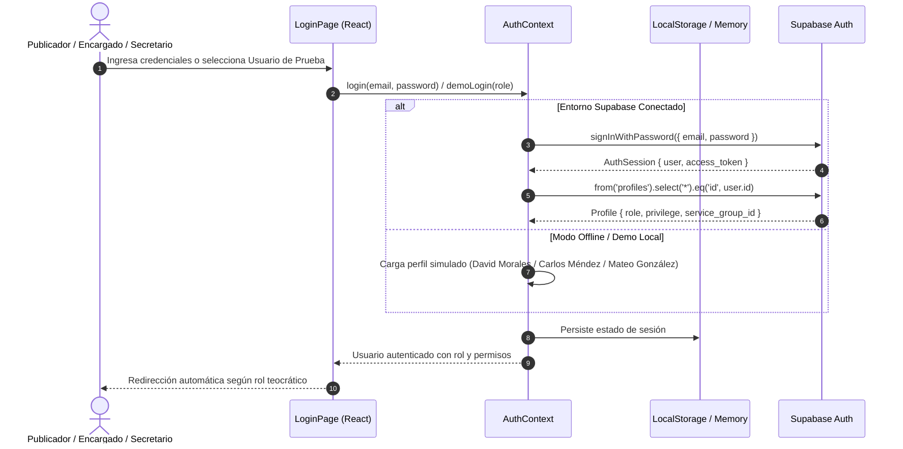
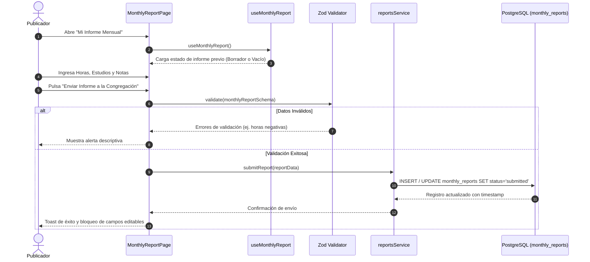
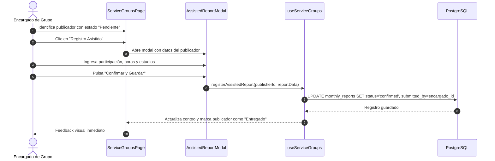
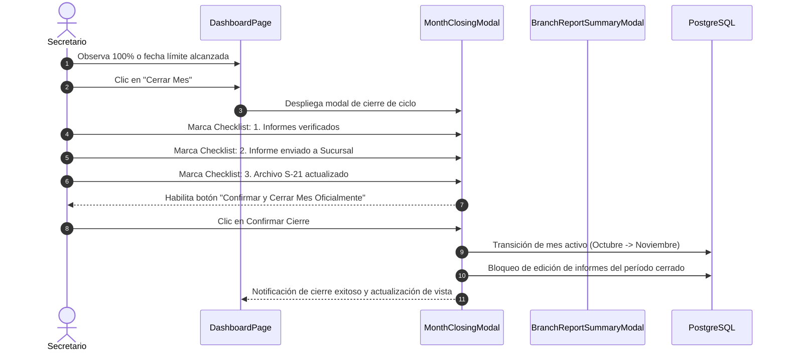
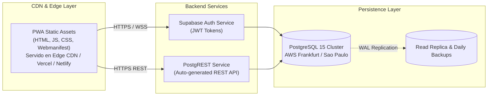

# 2. Arquitectura General del Sistema

## 2.1 Visión Arquitectónica de Alto Nivel
La arquitectura del sistema sigue el patrón **Modern Client-Side Architecture (JAMstack / SPA)** con sincronización Backend-as-a-Service (BaaS) apoyada en **Supabase** y almacenamiento en caché de cliente mediante **Service Worker**.

```mermaid
graph TD
    subgraph Cliente Web & Móvil (Browser / PWA)
        UI["Capa de Presentación<br>(React 18 + Tailwind CSS)"]
        ATOMIC["Diseño Atómico<br>(Atoms / Molecules / Organisms / Templates)"]
        STATE["Capa de Estado y Lógica<br>(Custom Hooks + AuthContext + Memory Cache)"]
        SW["Service Worker Cache<br>(stale-while-revalidate / Offline Storage)"]
        SERVICES["Servicios de Dominio<br>(publishersService, reportsService, etc.)"]
    end

    subgraph Capa de Red y Protocolo
        HTTPS["HTTPS REST / WebSockets"]
        CLIENT["Supabase Client JS (@supabase/supabase-js)"]
    end

    subgraph Backend Cloud (Supabase / PostgreSQL 15)
        POSTGREST["PostgREST API Engine"]
        AUTH["Supabase Auth (GoTrue)"]
        RLS["Políticas Row-Level Security (RLS)<br>(3 Niveles de Permisos)"]
        DB[(Base de Datos PostgreSQL<br>Tables, Enums, Triggers, Functions)]
    end

    UI --> ATOMIC
    ATOMIC --> STATE
    STATE --> SERVICES
    SERVICES --> CLIENT
    CLIENT --> HTTPS
    HTTPS --> POSTGREST
    HTTPS --> AUTH
    POSTGREST --> RLS
    RLS --> DB
    SW -.->|Fallback Offline| UI
```

## 2.2 Flujo de Autenticación y Control de Sesión
El sistema soporta autenticación mediante sesiones JWT administradas por Supabase Auth, complementadas con un modo de desarrollo y prueba reactivo con usuarios pre-configurados.



## 2.3 Flujo de Creación y Entrega del Informe Mensual


## 2.4 Flujo de Registro Asistido por el Encargado de Grupo


## 2.5 Flujo de Cierre de Mes Congregacional


## 2.6 Diagrama de Despliegue en Producción

