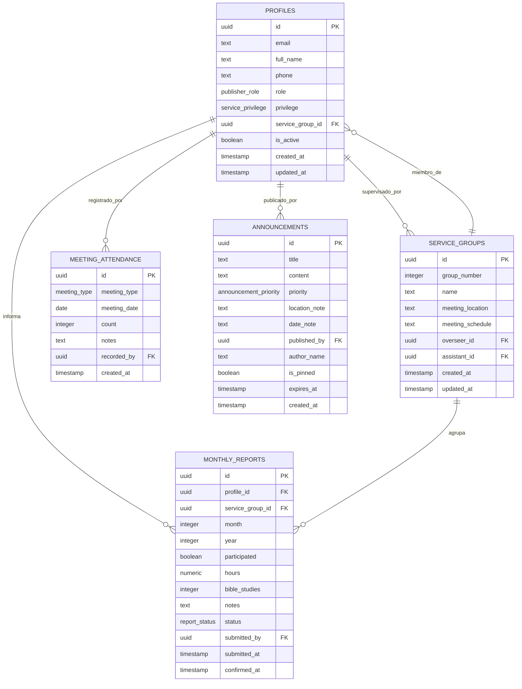

# 7. Base de Datos y Políticas de Seguridad (RLS)

## 7.1 Esquema de Base de Datos PostgreSQL (Supabase)
La base de datos se modela bajo el motor relacional **PostgreSQL 15** hospedado en Supabase. El archivo DDL oficial es [`supabase_schema.sql`](file:///c:/Desarrollo/Desarrollo/Desarrollo%20web/App_informes/supabase_schema.sql).



## 7.2 Tipos Enumerados (Custom Enums)
1. `publisher_role`: `'publicador'`, `'anciano'`, `'siervo_ministerial'`, `'secretario'`.
2. `service_privilege`: `'publicador_bautizado'`, `'publicador_no_bautizado'`, `'precursor_auxiliar'`, `'precursor_regular'`.
3. `report_status`: `'draft'`, `'submitted'`, `'confirmed'`.
4. `meeting_type`: `'entre_semana'`, `'fin_de_semana'`, `'especial'`.
5. `announcement_priority`: `'alta'`, `'normal'`, `'informativa'`.

---

## 7.3 Diccionario de Datos Completo

### Tabla: `public.profiles`
Almacena la identidad congregacional de cada hermano, vinculada con `auth.users`.
| Columna | Tipo | Nulo | Default | Restricciones / Descripción |
|---|---|---|---|---|
| `id` | `UUID` | NO | - | Primary Key, References `auth.users(id)` ON DELETE CASCADE |
| `email` | `TEXT` | SÍ | - | Correo electrónico de contacto |
| `full_name` | `TEXT` | NO | - | Nombre completo del publicador |
| `phone` | `TEXT` | SÍ | - | Teléfono con código de país (para recordatorios WhatsApp) |
| `role` | `publisher_role` | NO | `'publicador'` | Rol teocrático en la congregación |
| `privilege` | `service_privilege` | NO | `'publicador_bautizado'` | Nombramiento en la predicación |
| `service_group_id`| `UUID` | SÍ | - | References `service_groups(id)` ON DELETE SET NULL |
| `is_active` | `BOOLEAN` | NO | `true` | Estado de actividad en la congregación |
| `avatar_url` | `TEXT` | SÍ | - | URL de la imagen de perfil |
| `created_at` | `TIMESTAMPTZ` | NO | `now()` | Fecha de registro |
| `updated_at` | `TIMESTAMPTZ` | NO | `now()` | Fecha de última actualización |

### Tabla: `public.service_groups`
Registra los grupos de predicación organizados en la congregación.
| Columna | Tipo | Nulo | Default | Restricciones / Descripción |
|---|---|---|---|---|
| `id` | `UUID` | NO | `gen_random_uuid()` | Primary Key |
| `group_number` | `INTEGER` | NO | - | UNIQUE, Número oficial del grupo (ej. 1, 2, 3...) |
| `name` | `TEXT` | NO | - | Nombre descriptivo (ej. "Grupo 1 - Los Olivos") |
| `meeting_location`| `TEXT` | SÍ | - | Dirección del punto de salida a la predicación |
| `meeting_schedule`| `TEXT` | SÍ | - | Horario habitual de salida |
| `overseer_id` | `UUID` | SÍ | - | References `profiles(id)` ON DELETE SET NULL (Superintendente) |
| `assistant_id` | `UUID` | SÍ | - | References `profiles(id)` ON DELETE SET NULL (Auxiliar) |
| `created_at` | `TIMESTAMPTZ` | NO | `now()` | Fecha de creación |
| `updated_at` | `TIMESTAMPTZ` | NO | `now()` | Fecha de última actualización |

### Tabla: `public.monthly_reports`
Almacena el informe ministerial mensual de cada publicador.
| Columna | Tipo | Nulo | Default | Restricciones / Descripción |
|---|---|---|---|---|
| `id` | `UUID` | NO | `gen_random_uuid()` | Primary Key |
| `profile_id` | `UUID` | NO | - | References `profiles(id)` ON DELETE CASCADE |
| `service_group_id`| `UUID` | NO | - | References `service_groups(id)` ON DELETE RESTRICT |
| `month` | `INTEGER` | NO | - | CHECK (`month BETWEEN 1 AND 12`) |
| `year` | `INTEGER` | NO | - | CHECK (`year >= 2020`) |
| `participated` | `BOOLEAN` | NO | `true` | Indica si predicó en el mes |
| `hours` | `NUMERIC(5,1)` | NO | `0` | CHECK (`hours >= 0`) |
| `bible_studies` | `INTEGER` | NO | `0` | CHECK (`bible_studies >= 0`) |
| `notes` | `TEXT` | SÍ | - | Observaciones o comentarios pastorales |
| `status` | `report_status`| NO | `'draft'` | Estado del ciclo (`draft`, `submitted`, `confirmed`) |
| `submitted_by` | `UUID` | SÍ | - | References `profiles(id)` (Publicador o Encargado asistido) |
| `submitted_at` | `TIMESTAMPTZ` | NO | `now()` | Timestamp de envío |
| `confirmed_at` | `TIMESTAMPTZ` | SÍ | - | Timestamp de confirmación por el encargado/secretario |

*Constraint Única:* `UNIQUE(profile_id, month, year)` (Garantiza que no existan duplicados para el mismo hermano en el mismo mes).

---

## 7.4 Análisis de Políticas de Seguridad Row-Level Security (RLS)
El sistema activa RLS en el 100% de las tablas. La seguridad no se delega en la interfaz de React: el motor de base de datos intercepta cada consulta HTTP en el API Gateway.

### Funciones Auxiliares de Seguridad (`SECURITY DEFINER`)
```sql
CREATE OR REPLACE FUNCTION public.is_admin_or_elder()
RETURNS BOOLEAN AS $$
  SELECT EXISTS (
    SELECT 1 FROM public.profiles
    WHERE id = auth.uid() AND role IN ('anciano', 'secretario')
  );
$$ LANGUAGE sql SECURITY DEFINER STABLE;

CREATE OR REPLACE FUNCTION public.is_group_overseer(target_group_id UUID)
RETURNS BOOLEAN AS $$
  SELECT EXISTS (
    SELECT 1 FROM public.service_groups
    WHERE id = target_group_id AND (overseer_id = auth.uid() OR assistant_id = auth.uid())
  );
$$ LANGUAGE sql SECURITY DEFINER STABLE;
```

### Políticas por Tabla:
1. **`profiles`:**
   - `SELECT`: Permitido para todos los usuarios autenticados.
   - `UPDATE`: Permitido a los usuarios para actualizar su propio registro (`id = auth.uid()`) y a ancianos/secretarios para administrar cualquier perfil.
   - `INSERT / DELETE`: Exclusivo para ancianos y secretarios.
2. **`monthly_reports`:**
   - `SELECT`:
     - El propio publicador (`profile_id = auth.uid()`).
     - El encargado del grupo al que pertenece el informe (`is_group_overseer(service_group_id)`).
     - Ancianos y secretario (`is_admin_or_elder()`).
   - `INSERT`:
     - El propio publicador para su propio informe.
     - El encargado para registro asistido dentro de su grupo.
     - Ancianos y secretario.
   - `UPDATE`:
     - El publicador solo si el informe está en estado `'draft'`.
     - El encargado para confirmar o editar informes de su grupo.
     - El secretario en cualquier momento antes del cierre oficial.
