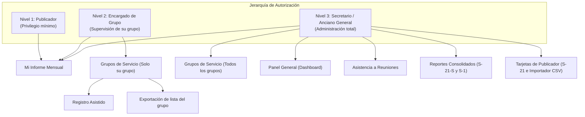

# 8. Autenticación, Roles y Matriz de Control de Acceso

## 8.1 Niveles de Acceso Teocrático
La organización de los permisos refleja fielmente la estructura teocrática de las congregaciones:

## 8.2 Matriz de Control de Acceso (RBAC)
A continuación se detalla explícitamente qué acciones puede realizar cada rol sobre los distintos recursos de la plataforma:

| Recurso / Módulo | Acción | Publicador | Encargado de Grupo | Anciano / Secretario | Implementación / Enforcement |
|---|---|:---:|:---:|:---:|---|
| **Mi Informe Mensual** | Ver su propio informe | SÍ | SÍ | SÍ | UI Route + RLS (`profile_id = auth.uid()`) |
| **Mi Informe Mensual** | Modificar su propio informe | SÍ | SÍ | SÍ | UI Route + RLS (`status = 'draft'`) |
| **Mi Informe Mensual** | Modificar informe de otro hermano | NO | NO | SÍ | RLS (`is_admin_or_elder()`) |
| **Grupos de Servicio** | Ver lista de todos los grupos | NO | NO | SÍ | UI Guard + RLS |
| **Grupos de Servicio** | Ver lista de su propio grupo | NO | SÍ | SÍ | UI Hook Filter + RLS (`is_group_overseer`) |
| **Grupos de Servicio** | Crear o Eliminar grupos | NO | NO | SÍ | UI Button Oculto + RLS (`is_admin_or_elder`) |
| **Grupos de Servicio** | Registro Asistido para hermanos | NO | SÍ | SÍ | UI Modal + RLS Insert |
| **Panel General** | Ver KPIs y Gráfica congregacional | NO | NO | SÍ | UI Route Guard (`role === 'secretario'`) |
| **Panel General** | Enviar avisos por WhatsApp | NO | NO | SÍ | UI Button + WhatsApp Modal |
| **Panel General** | Ejecutar Cierre Mensual Oficial | NO | NO | SÍ | UI Button + MonthClosingModal |
| **Asistencia a Reuniones**| Ver historial y promedios | NO | NO | SÍ | UI Route Guard |
| **Asistencia a Reuniones**| Registrar nueva asistencia | NO | NO | SÍ | UI Form + RLS (`is_admin_or_elder`) |
| **Reportes Consolidados** | Ver tabla anual S-21-S | NO | NO | SÍ | UI Route Guard |
| **Reportes Consolidados** | Ver Informe para Sucursal (S-1) | NO | NO | SÍ | UI Modal S-1 |
| **Reportes Consolidados** | Exportar PDF / Excel | NO | NO | SÍ | `exportService` |
| **Tarjetas de Publicador**| Ver archivo S-21 de 12 meses | NO | NO | SÍ | UI Route Guard |
| **Tarjetas de Publicador**| Dar de alta o baja a publicadores| NO | NO | SÍ | RLS Update `is_active` |
| **Tarjetas de Publicador**| Transferir publicador entre grupos| NO | NO | SÍ | RLS Update `service_group_id` |
| **Tarjetas de Publicador**| Importación Masiva CSV | NO | NO | SÍ | `PublisherImportModal` |
| **Tablón de Anuncios** | Leer comunicados | SÍ | SÍ | SÍ | UI Card + RLS Select público |
| **Tablón de Anuncios** | Publicar y Eliminar anuncios | NO | NO | SÍ | UI `canManage=true` + RLS Delete |

---

## 8.3 Protección en el Frontend (Guards y Rutas Protegidas)
En el componente raíz [`App.tsx`](file:///c:/Desarrollo/Desarrollo/Desarrollo%20web/App_informes/src/App.tsx), el sistema ejecuta una evaluación de permisos reactiva con cada cambio de navegación:

1. Si el usuario intenta forzar la URL o el estado hacia `'dashboard'`, `'consolidated'`, `'publishers'` o `'attendance'` siendo un **publicador**, el sistema lo redirige automáticamente a `'monthly_report'`.
2. Si un **encargado de grupo** intenta acceder a la administración global o tarjetas individuales de toda la congregación, el sistema lo mantiene restringido a `'service_groups'` y su propio `'monthly_report'`.
3. Los botones y enlaces restringidos no se renderizan en el DOM para evitar fugas de información (*Information Disclosure*).
