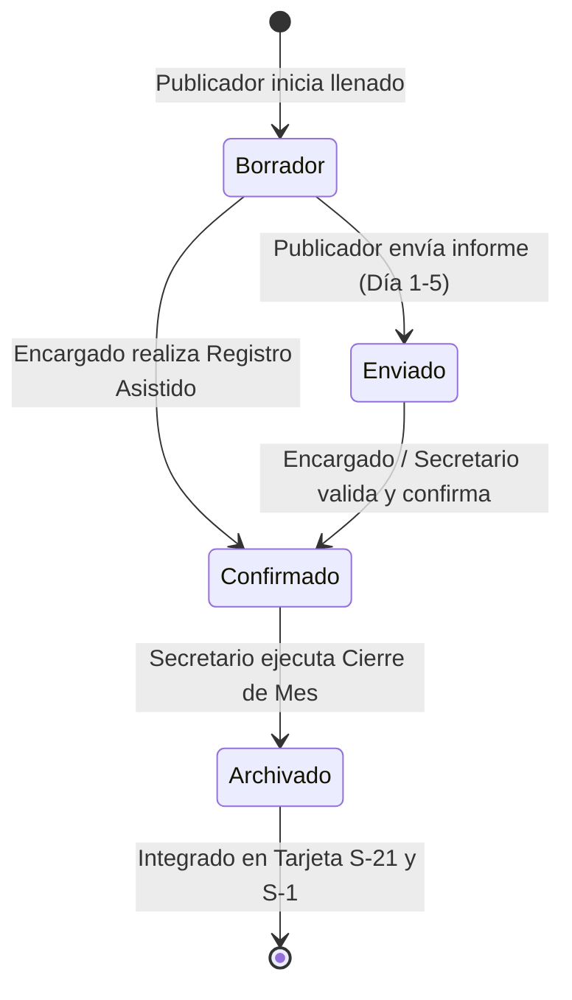

# 9. Reglas de Negocio y Ciclo de Vida del Informe Ministerial

## 9.1 Ciclo de Vida del Informe Ministerial
El informe de predicación mensual atraviesa tres estados canónicos controlados en base de datos:

1. **Borrador (`draft`):** El publicador ha comenzado a ingresar notas o cifras tentativas en su dispositivo, pero no ha concluido el envío. Los datos son editables exclusivamente por el propio publicador.
2. **Enviado (`submitted`):** El informe ha sido remitido formalmente a la congregación. Los campos se bloquean en la interfaz del publicador para evitar modificaciones accidentales. El encargado de grupo y el secretario visualizan el informe como "Entregado".
3. **Confirmado (`confirmed`):** El informe ha sido revisado por el encargado de grupo o fue registrado mediante asistencia pastoral directa. El registro queda listo para tabulación en el S-1.
4. **Archivado:** Tras el cierre oficial del mes en el Panel General, el informe pasa a formar parte inmutable del historial teocrático de 12 meses (S-21 individual y S-21-S consolidado).

---

## 9.2 Catálogo Exhaustivo de Reglas de Negocio (Business Rules)

| ID | Regla de Negocio | Origen Teocrático / Técnico | Implementación en Código | Validación | Tests que lo Cubren | Nivel de Riesgo | Estado |
|---|---|---|---|---|---|:---:|:---:|
| **BR-001** | **No obligatoriedad de horas para publicadores generales:** Los publicadores bautizados y no bautizados solo informan participación (booleano) y estudios bíblicos; las horas no son requeridas ni obligatorias. | Ajuste Teocrático Mundial (Nov 2023) | `monthlyReportSchema.ts`, `MonthlyReportPage.tsx` | `zod.object({ participated: z.boolean(), bible_studies: z.number() })` | `monthlyReportSchema.test.ts` | Alto (Desvío teocrático) | **IMPLEMENTADO** |
| **BR-002** | **Obligatoriedad de horas para precursores:** Los precursores regulares y auxiliares deben reportar obligatoriamente un número mayor a cero de horas mensuales. | Instrucciones para la Secretaría (S-1) | `monthlyReportSchema.ts` | `superRefine` en Zod que exige `hours > 0` si `role !== 'publicador'` | `monthlyReportSchema.test.ts` | Crítico (Datos a Sucursal) | **IMPLEMENTADO** |
| **BR-003** | **Estudios bíblicos no negativos:** La cantidad de cursos bíblicos debe ser un entero mayor o igual a cero. | Lógica de Dominio | `monthlyReportSchema.ts` | `z.number().int().min(0)` | `monthlyReportSchema.test.ts` | Medio (Integridad) | **IMPLEMENTADO** |
| **BR-004** | **Unicidad de informe mensual:** Ningún publicador puede poseer más de un informe para el mismo mes y año. | Integridad Relacional | `supabase_schema.sql` | `UNIQUE(profile_id, month, year)` en tabla `monthly_reports` | Test de integridad PostgreSQL | Crítico (Duplicidad en S-1) | **IMPLEMENTADO** |
| **BR-005** | **Fecha de corte de informes:** Los publicadores deben entregar su informe a más tardar el día 5 del mes siguiente; el día 6 el sistema emite alerta urgente a encargados. | Procedimiento de Secretaría | `AlertBanner.tsx`, `DashboardPage.tsx` | Cálculo de días restantes en relación al día 6 | `AlertBanner.test.tsx` | Medio (Operativo) | **IMPLEMENTADO** |
| **BR-006** | **Segregación estricta de grupo para encargados:** Un encargado de grupo solo puede ver y registrar informes de publicadores pertenecientes a su propio grupo. | Privacidad Teocrática | `useServiceGroups.ts`, RLS `is_group_overseer` | Filtro por `user.service_group_id` en hook y función SQL | `App.test.tsx`, `useServiceGroups.test.ts` | Crítico (Privacidad) | **IMPLEMENTADO** |
| **BR-007** | **Registro Asistido con autoría teocrática:** Cuando un encargado registra un informe a nombre de un publicador, se registra quién lo ingresó (`submitted_by`). | Auditoría de Secretaría | `AssistedReportModal.tsx`, `reportsService.ts` | Almacena el `id` del encargado en la columna `submitted_by` | `AssistedReportModal.test.tsx` | Medio (Trazabilidad) | **IMPLEMENTADO** |
| **BR-008** | **Checklist obligatorio para cierre de mes:** El cierre de ciclo mensual exige marcar afirmativamente los 3 puntos de verificación antes de habilitar el botón de cierre. | Control de Calidad de Secretaría | `MonthClosingModal.tsx` | Estado booleano en React que valida `check1 && check2 && check3` | `MonthClosingModal.test.tsx` | Alto (Cierres prematuros) | **IMPLEMENTADO** |
| **BR-009** | **Avance de ciclo mensual:** Al cerrar un mes, el mes activo de la congregación avanza al siguiente (de 12 pasa a 1 incrementando el año). | Calendario Teocrático | `DashboardPage.tsx` | Función `handleConfirmCloseMonth` con lógica circular 1-12 | `DashboardPage.test.tsx` | Alto (Continuidad de datos) | **IMPLEMENTADO** |
| **BR-010** | **Historial individual S-21 de 12 meses:** La tarjeta individual del publicador debe presentar exactamente los 12 meses del Año de Servicio actual (Septiembre a Agosto). | Formato Canónico S-21 | `publishersService.ts`, `PublisherCardS21View.tsx` | Matriz de 12 meses estructurada con sumatorias anuales | `PublisherCardS21View.test.tsx` | Alto (Auditoría de Circuito) | **IMPLEMENTADO** |
| **BR-011** | **Preservación de historial al dar de baja:** Cuando un publicador es dado de baja (`is_active = false`), sus informes previos permanecen intactos en el consolidado. | Auditoría Histórica | `PublisherCardsPage.tsx`, `supabase_schema.sql` | Soft delete (`is_active = false`), no `DELETE CASCADE` en informes | `PublisherCardsPage.test.tsx` | Crítico (Pérdida histórica) | **IMPLEMENTADO** |
| **BR-012** | **Reasignación obligatoria al eliminar un grupo:** No es posible eliminar un grupo de servicio si tiene publicadores asignados sin antes transferirlos a otro grupo activo. | Integridad Congregacional | `DeleteGroupModal.tsx` | Modal que fuerza la selección de un grupo destino de respaldo | `DeleteGroupModal.test.tsx` | Crítico (Publicadores huérfanos) | **IMPLEMENTADO** |
| **BR-013** | **Meta de 600 horas anuales para precursores:** El sistema calcula el déficit o superávit con base en el promedio de 50 horas/mes para evaluar el progreso anual. | Guía de Precursores | `RegularPioneersGoalCard.tsx` | Algoritmo de proyección mensual contra el acumulado real | `RegularPioneersGoalCard.test.tsx` | Medio (Pastoral) | **IMPLEMENTADO** |
| **BR-014** | **Cálculo de asistencia semanal promedio:** Los promedios mensuales de asistencia se calculan dividiendo la suma total de asistentes entre el número de reuniones celebradas en el mes. | Formato S-1 | `attendanceService.ts`, `useMeetingAttendance.ts` | Cálculo desacoplado para reunión Entre Semana y Fin de Semana | `attendanceService.test.ts` | Alto (Cifras de Sucursal) | **IMPLEMENTADO** |
| **BR-015** | **Auto-detección de delimitadores en CSV:** El importador masivo debe soportar tanto coma (`,`) como punto y coma (`;`) para compatibilidad con Excel en español e inglés. | Usabilidad Administrativa | `csvImportService.ts` | Regex detector de separador preponderante en la primera línea | `csvImportService.test.ts` | Medio (Carga de nómina) | **IMPLEMENTADO** |
| **BR-016** | **Mensajes personalizados de felicitación por grupo:** Si un grupo alcanza el 100% de informes entregados, el mensaje generado para WhatsApp cambia a felicitación y agradecimiento. | Pastoral Teocrática | `whatsappReminderService.ts` | Condicional `pendingCount === 0` genera texto festivo de reconocimiento | `whatsappReminderService.test.ts` | Bajo (Experiencia de usuario) | **IMPLEMENTADO** |
| **BR-017** | **Restricción de iconografía religiosa:** El sistema no debe utilizar crucifijos ni cruces en ninguna vista, usando exclusivamente edificios institucionales (`Building2`). | Doctrina Teocrática | `favicon.svg`, Layouts, Modales | Uso estricto de `Building2` y `FileText` de Lucide React | Pruebas visuales y de build | Alto (Respeto doctrinal) | **IMPLEMENTADO** |
| **BR-018** | **Copia limpia al portapapeles del resumen S-1:** El botón de copiar en el modal de la Sucursal debe emitir texto plano ordenado listo para el portal oficial. | Eficiencia Administrativa | `BranchReportSummaryModal.tsx` | Concatenación de texto formateado con saltos de línea | `BranchReportSummaryModal.test.tsx` | Medio (Operativo) | **IMPLEMENTADO** |
| **BR-019** | **Priorización visual de comunicados:** Los anuncios con prioridad `alta` se colocan al inicio del tablón y se destacan con borde y acento ámbar. | Comunicación Efectiva | `AnnouncementsBoard.tsx`, `announcementsService.ts` | Algoritmo de ordenamiento por prioridad y timestamp | `announcementsService.test.ts` | Bajo (Diseño) | **IMPLEMENTADO** |
| **BR-020** | **Compatibilidad Offline PWA:** La aplicación debe cargar la interfaz y permitir la consulta de datos en caché cuando el dispositivo no tiene acceso a internet. | Continuidad Operativa | `public/sw.js`, `manifest.webmanifest` | Estrategia de Service Worker *stale-while-revalidate* | Build y registro en `main.tsx` | Alto (Disponibilidad) | **IMPLEMENTADO** |
