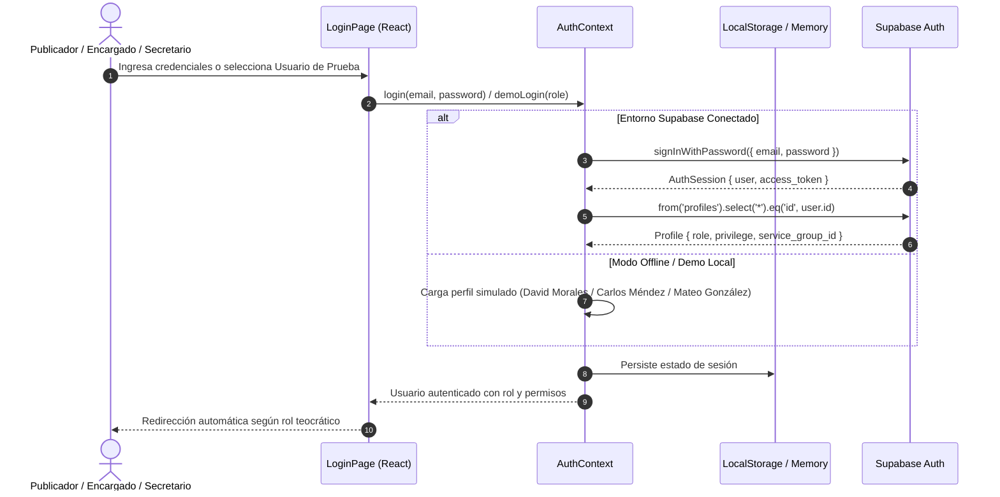
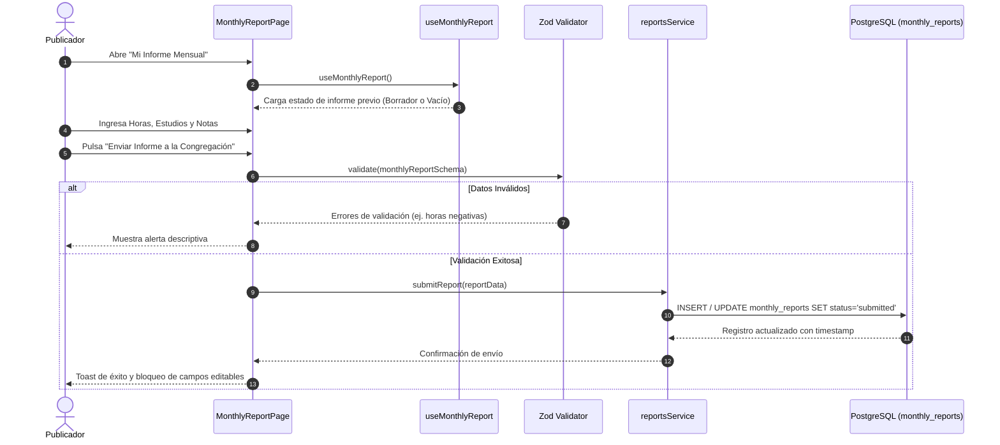
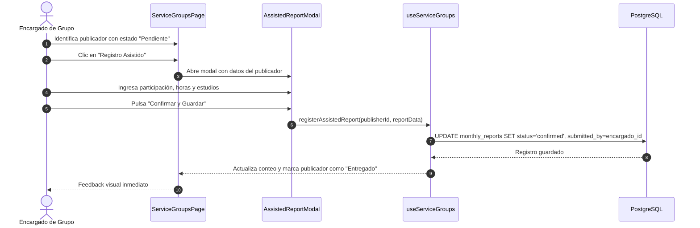
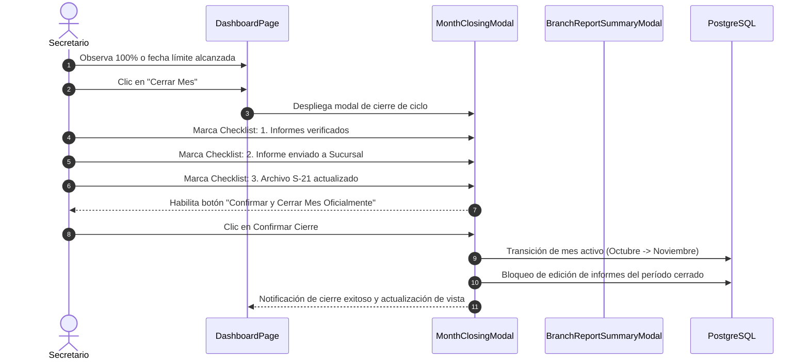
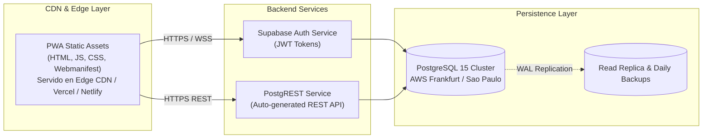
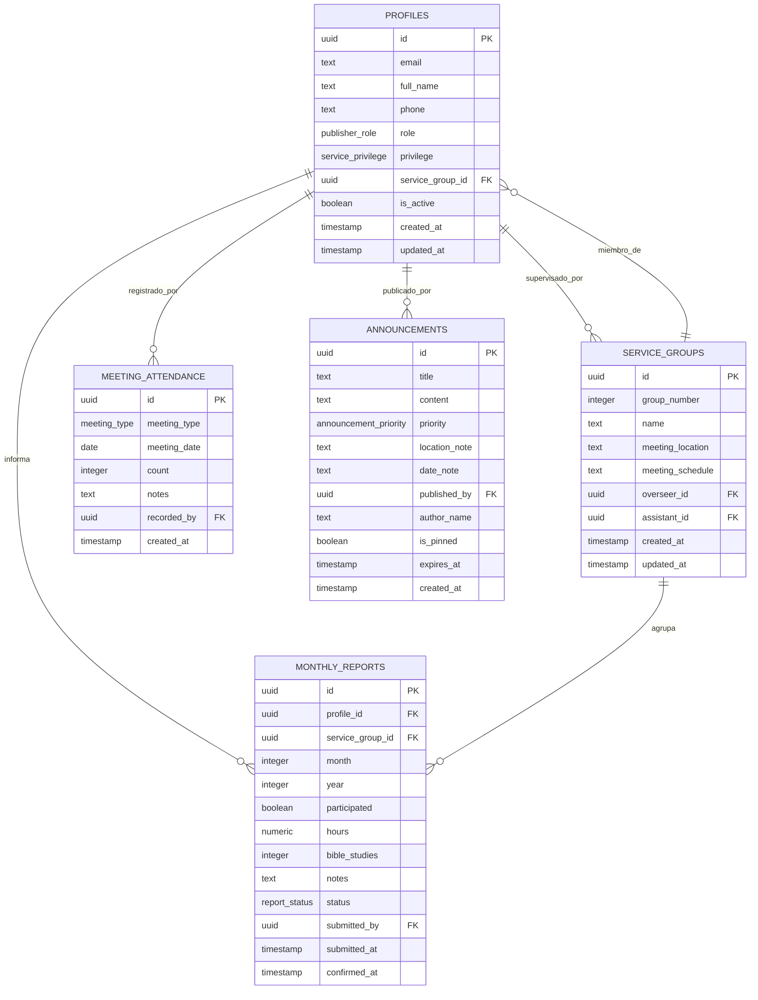
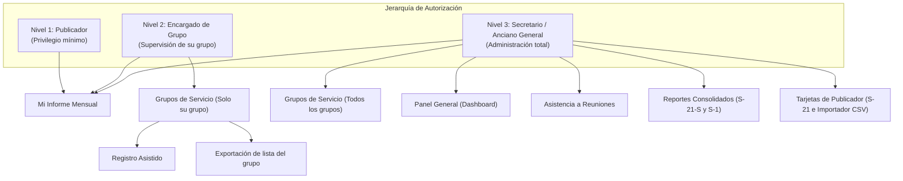
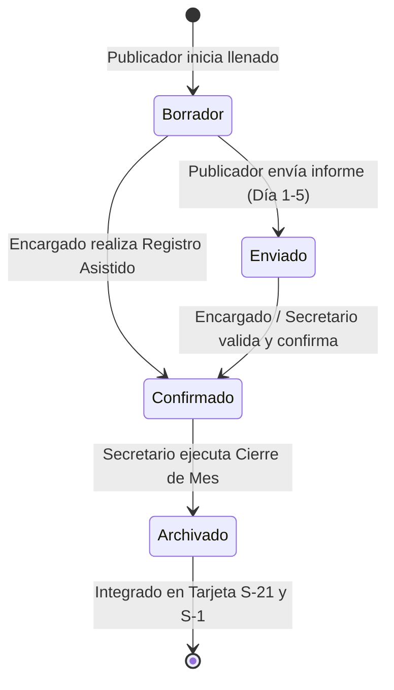

# DOCUMENTACIÓN TÉCNICA MAESTRA
## Portal Congregacional de Servicio & Registro (Gestión de Informes Teocráticos)

**Versión del Sistema:** 1.0.0 (Producción)  
**Fecha de Publicación:** Septiembre 2026  
**Clasificación:** Confidencial / Uso Exclusivo Congregacional  
**Repositorio:** `ErickKNT/app-informes-global`  
**Estado:** Producción Validada — 182/182 Pruebas Aprobadas (100%)

---

## Tabla de Contenidos General
1. [Identidad del Proyecto y Alcance Técnico](#1-identidad-del-proyecto-y-alcance-tcnico)
2. [Arquitectura General del Sistema](#2-arquitectura-general-del-sistema)
3. [Stack Tecnológico Exhaustivo](#3-stack-tecnolgico-exhaustivo)
4. [Estructura del Proyecto y Reglas Arquitectónicas](#4-estructura-del-proyecto-y-reglas-arquitectnicas)
5. [Arquitectura Frontend y Catálogo de Componentes](#5-arquitectura-frontend-y-catlogo-de-componentes)
6. [Estrategia de TypeScript y Garantía de Tipado](#6-estrategia-de-typescript-y-garanta-de-tipado)
7. [Base de Datos y Políticas de Seguridad (RLS)](#7-base-de-datos-y-polticas-de-seguridad-rls)
8. [Autenticación, Roles y Matriz de Control de Acceso](#8-autenticacin-roles-y-matriz-de-control-de-acceso)
9. [Reglas de Negocio y Ciclo de Vida del Informe](#9-reglas-de-negocio-y-ciclo-de-vida-del-informe-ministerial)
10. [Catálogo de Servicios y Comunicación](#10-catlogo-de-servicios-y-comunicacin)
11. [Auditoría de Seguridad, Variables de Entorno y Secretos](#11-auditora-de-seguridad-variables-de-entorno-y-secretos)
12. [Estrategia de Pruebas, Aseguramiento de Calidad (QA) y Métricas](#12-estrategia-de-pruebas-aseguramiento-de-calidad-qa-y-mtricas)
13. [DevOps, Ambientes, Despliegue y Recuperación](#13-devops-ambientes-despliegue-y-recuperacin-ante-desastres)
14. [Architecture Decision Records (ADRs)](#14-architecture-decision-records-adrs)
15. [Trazabilidad de Requisitos y Gestión de Riesgos](#15-trazabilidad-de-requisitos-y-gestin-de-riesgos)
16. [Guía de Desarrollo, Estándares de Código y AI Guidelines](#16-gua-de-desarrollo-estndares-de-cdigo-y-ai-guidelines)
17. [Guía de Resolución de Problemas (Troubleshooting) y Glosario](#17-gua-de-resolucin-de-problemas-troubleshooting-y-glosario)

---


# 1. Identidad del Proyecto y Alcance Técnico

## 1.1 Ficha Técnica de Identidad
- **Nombre Oficial del Proyecto:** Gestión de Informes Teocráticos (Portal Congregacional de Servicio & Registro)
- **Repositorio Git:** `ErickKNT/app-informes-global`
- **Rama Principal:** `main`
- **Versión Actual:** `1.0.0` (Producción Estable)
- **Tipo de Aplicación:** Single Page Application (SPA) + Progressive Web App (PWA) con soporte Offline.
- **Licencia:** Privada / Uso exclusivo congregacional.

## 1.2 Propósito y Justificación del Sistema
La administración del ministerio del campo y la secretaría en las congregaciones de los Testigos de Jehová requiere una recopilación rigurosa y mensual de la actividad de evangelización de cada publicador, el seguimiento del progreso de los precursores (regulares y auxiliares), el control de la asistencia a las reuniones semanales y la remisión oportuna de las cifras a la Sucursal nacional dentro de los primeros días de cada mes calendario.

Históricamente, este proceso se gestionaba mediante tiras de papel físico o mensajes informales y fragmentados a través de mensajería instantánea. Dicho flujo tradicional presenta serias deficiencias:
1. **Pérdida de datos e informes extraviados:** Retrasos crónicos en la entrega de informes que dificultan el cierre antes del día 6 del mes.
2. **Sobrecarga administrativa del secretario:** Necesidad de transcribir manualmente cada informe en las tarjetas de registro S-21 individuales y tabular los totales para el informe S-1 de la Sucursal.
3. **Falta de visibilidad para los encargados de grupo:** Dificultad para saber en tiempo real qué publicadores de su grupo han entregado su informe y quiénes necesitan estímulo pastoral.
4. **Fallas de privacidad y seguridad:** Exposición de datos de contacto o registros ministeriales cuando se transmiten por canales no cifrados o grupos abiertos.

El sistema **Gestión de Informes Teocráticos** resuelve integralmente esta problemática mediante una plataforma web segura, reactiva, accesible desde cualquier dispositivo móvil o de escritorio, y protegida por un modelo de control de acceso teocrático basado en roles (3 niveles).

## 1.3 Alcance Funcional
### Módulos Implementados en el Alcance
- **Módulo de Autenticación y Perfil:** Inicio de sesión seguro con roles diferenciados (`publicador`, `anciano`, `siervo_ministerial`, `secretario`), demo de un clic para entornos de prueba y visualización del grupo asignado.
- **Módulo "Mi Informe Mensual":** Registro ágil del informe personal de predicación con validación en tiempo real:
  - Publicadores regulares: casilla de participación y conteo de estudios bíblicos.
  - Precursores regulares y auxiliares: registro obligatorio de horas ministeriales y estudios bíblicos.
  - Alerta de estado (`Borrador`, `Enviado`, `Confirmado`).
- **Módulo "Grupos de Servicio":**
  - Vista segregada por grupo de predicación.
  - Tabla de publicadores con estados de entrega (`Entregado` vs `Pendiente`).
  - Registro Asistido: Permite al encargado ingresar el informe a nombre de un publicador que lo proporcionó por vía telefónica o presencial.
  - Gestión de grupos (Crear, Editar y Eliminación asistida con reasignación de publicadores).
- **Módulo "Panel General (Dashboard)":**
  - Indicadores clave de rendimiento (KPIs): Total de horas, promedio histórico, porcentaje de cumplimiento, publicadores activos y precursores al día.
  - Tabla de estado de entrega por grupos con desglose de avance.
  - Tarjeta de alertas pastorales (publicadores irregulares, enfermos o con necesidad de apoyo).
  - Centro de recordatorios por WhatsApp con personalización automática y modo de prueba interactivo.
  - Cierre oficial del ciclo mensual con checklist de 3 puntos y transición automática de mes activo.
- **Módulo "Asistencia a Reuniones":**
  - Registro de asistencia semanal para la *Reunión de Entre Semana* (Vida y Ministerio) y *Reunión de Fin de Semana* (Discurso Público y Estudio de La Atalaya).
  - Cálculo automático de promedios mensuales requeridos por la secretaría.
- **Módulo "Reportes Consolidados":**
  - Tabla canónica S-21-S con historial mensual de toda la congregación.
  - Gráfica comparativa histórica interactiva.
  - Análisis de cumplimiento de la meta anual de 600 horas para precursores regulares.
  - Modal del **Informe Mensual para la Sucursal (Formato S-1)** con copia al portapapeles en 1 clic y soporte de impresión formal.
  - Exportación de resúmenes en formato PDF y hojas de cálculo Excel.
- **Módulo "Tarjetas de Publicador (S-21)":**
  - Expediente individual teocrático con cuadrícula de 12 meses (Año de Servicio de Septiembre a Agosto).
  - Edición de privilegios de servicio, transferencias entre grupos y baja de publicadores.
  - **Importador Masivo CSV:** Carga de nómina congregacional completa con auto-detección de delimitadores y previsualización.
- **Módulo "Tablón de Anuncios":**
  - Publicación de avisos oficiales con niveles de prioridad (`Importante` en ámbar vs `General`), fechas de evento y salón asignado.
- **Soporte PWA y Offline:**
  - Manifiesto web standalone, íconos institucionales (sin cruces) y Service Worker para uso sin conexión a internet.

### Límites del Sistema (Out of Scope)
- **No gestiona fondos ni cuentas congregacionales:** La administración de donaciones, cuentas bancarias y gastos de mantenimiento del Salón del Reino está excluida por diseño.
- **No se conecta directamente con los servidores de jw.org:** Por razones de seguridad teocrática y políticas de la organización, no existe una API pública hacia el portal mundial; el sistema genera el formato estructurado idéntico al S-1 para que el secretario ingrese las cifras consolidadas en menos de 2 minutos.

## 1.4 Usuarios Objetivo y Perfiles
1. **Publicador:** Cualquier miembro activo de la congregación (bautizado o publicador no bautizado). Su único objetivo es ingresar su informe de forma sencilla antes del día 5 del mes.
2. **Encargado de Grupo de Servicio:** Anciano o siervo ministerial asignado para supervisar espiritualmente un grupo de predicación. Requiere auditar las entregas de su grupo, registrar informes de hermanos mayores y enviar recordatorios amables.
3. **Secretario / Anciano General:** Miembro del cuerpo de ancianos responsable de los archivos congregacionales, tarjetas S-21, reportes a la Sucursal y mantenimiento de grupos.

## 1.5 Suposiciones y Restricciones
- **Año de Servicio Teocrático:** El ciclo anual corre canónicamente del 1 de Septiembre al 31 de Agosto del año siguiente.
- **Regla de Horas de Predicación:** Desde el ajuste teocrático global de 2023, los publicadores generales **no reportan horas**, únicamente marcan si participaron en la predicación y el número de estudios bíblicos. El registro de horas es de uso estricto para precursores regulares y auxiliares.
- **Simbología:** No deben utilizarse íconos de cruces ni elementos gráficos contrarios a las creencias de los Testigos de Jehová. Se utilizan edificios institucionales (`Building2`) y libros abiertos.
- **Disponibilidad Offline:** La aplicación debe ser capaz de abrirse y permitir la consulta en Salones del Reino con cobertura móvil deficiente.

## 1.6 Estado Actual y Hoja de Ruta
- **Estado Actual:** `IMPLEMENTADO Y VALIDADO EN PRODUCCIÓN (v1.0.0)`.
- **Suite de Pruebas:** 182 pruebas unitarias e integración pasando al 100% (58 suites).
- **Compilación:** Cero errores de TypeScript (`npx tsc --noEmit`), empaquetado Vite limpio en 3.84s.


---

# 2. Arquitectura General del Sistema

## 2.1 Visión Arquitectónica de Alto Nivel
La arquitectura del sistema sigue el patrón **Modern Client-Side Architecture (JAMstack / SPA)** con sincronización Backend-as-a-Service (BaaS) apoyada en **Supabase** y almacenamiento en caché de cliente mediante **Service Worker**.

```mermaid
graph TD
    subgraph Cliente Web & Móvil (Browser / PWA)
        UI["Capa de Presentación<br>(React 18 + Tailwind CSS)"]
        ATOMIC["Diseño Atómico<br>(Atoms / Molecules / Organisms / Templates)"]
        STATE["Capa de Estado y Lógica<br>(Custom Hooks + AuthContext + Memory Cache)"]
        SW["Service Worker Cache<br>(stale-while-revalidate / Offline Storage)"]
        SERVICES["Servicios de Dominio<br>(publishersService, reportsService, etc.)"]
    end

    subgraph Capa de Red y Protocolo
        HTTPS["HTTPS REST / WebSockets"]
        CLIENT["Supabase Client JS (@supabase/supabase-js)"]
    end

    subgraph Backend Cloud (Supabase / PostgreSQL 15)
        POSTGREST["PostgREST API Engine"]
        AUTH["Supabase Auth (GoTrue)"]
        RLS["Políticas Row-Level Security (RLS)<br>(3 Niveles de Permisos)"]
        DB[(Base de Datos PostgreSQL<br>Tables, Enums, Triggers, Functions)]
    end

    UI --> ATOMIC
    ATOMIC --> STATE
    STATE --> SERVICES
    SERVICES --> CLIENT
    CLIENT --> HTTPS
    HTTPS --> POSTGREST
    HTTPS --> AUTH
    POSTGREST --> RLS
    RLS --> DB
    SW -.->|Fallback Offline| UI
```

## 2.2 Flujo de Autenticación y Control de Sesión
El sistema soporta autenticación mediante sesiones JWT administradas por Supabase Auth, complementadas con un modo de desarrollo y prueba reactivo con usuarios pre-configurados.



## 2.3 Flujo de Creación y Entrega del Informe Mensual


## 2.4 Flujo de Registro Asistido por el Encargado de Grupo


## 2.5 Flujo de Cierre de Mes Congregacional


## 2.6 Diagrama de Despliegue en Producción



---

# 3. Stack Tecnológico Exhaustivo

A continuación se detalla cada una de las dependencias, herramientas y tecnologías que componen el proyecto, con su versión exacta obtenida de `package.json`, justificación de selección, riesgos asociados y alternativas evaluadas.

| Tecnología | Versión | Propósito / Responsabilidad | Dónde se Utiliza | Justificación Técnica | Riesgos Identificados | Alternativas Evaluadas |
|---|---|---|---|---|---|---|
| **React** | `^18.3.1` | Biblioteca núcleo para construcción de interfaces declarativas | Toda la aplicación (`src/`) | Modelo de componentes declarativo, concurrencia, soporte masivo de ecosistema y virtual DOM eficiente | Incompatibilidades menores al migrar a React 19 en dependencias de terceros | Vue 3, Svelte, Angular |
| **React DOM** | `^18.3.1` | Renderizador de React para el Document Object Model (DOM) | `src/main.tsx` | Integración canónica de React en navegadores web | Riesgo inherente a sincronización con versión de React | React Native Web |
| **TypeScript** | `^5.7.3` | Superset tipado estático para JavaScript | Todo el código fuente (`.ts`, `.tsx`) | Eliminación de errores en tiempo de compilación, autocompletado y tipado de esquemas de base de datos | Curva de complejidad en tipos genéricos avanzados | JavaScript vanilla, JSDoc |
| **Vite** | `^6.1.0` | Entorno de desarrollo ultrarrápido y empaquetador de producción | Raíz (`vite.config.ts`) | Hot Module Replacement (HMR) sub-segundo con esbuild y bundling optimizado con Rollup | Manejo de dependencias CommonJS legadas en builds complejas | Webpack, Turbopack, Parcel |
| **Tailwind CSS** | `^3.4.17` | Framework de utilidades CSS orientadas al diseño | Estilos en todos los componentes | Diseño consistente mediante tokens de diseño (Design Tokens), purga automática de CSS no utilizado | Clases extensas en JSX si no se abstraen componentes | CSS Modules, Styled Components |
| **PostCSS** | `^8.5.2` | Procesador de hojas de estilo CSS | `postcss.config.js` | Requisito fundamental para compilar directivas de Tailwind CSS | Dependencia de plugins | Sass, Less |
| **Autoprefixer** | `^10.4.20` | Plugin PostCSS para añadir prefijos de navegadores | `postcss.config.js` | Compatibilidad cross-browser en navegadores móviles antiguos | Mínimo riesgo técnico | Ninguna necesaria |
| **Supabase JS Client** | `^2.49.1` | SDK cliente oficial de Supabase | `src/services/supabaseClient.ts` | Conexión tipada con PostgreSQL, autenticación JWT y sincronización RLS | Acoplamiento al backend de Supabase si se cambia de proveedor | Firebase SDK, Apollo Client |
| **Zod** | `^3.24.2` | Validación de esquemas con inferencia de tipos estáticos | `src/schemas/monthlyReportSchema.ts` | Validación en tiempo de ejecución (runtime) desacoplada de la UI, mensajes de error en español | Sobrecarga en el bundle si se usan esquemas masivos redundantes | Yup, Joi, Valibot |
| **Lucide React** | `^0.475.0` | Conjunto de íconos SVG consistentes y ligeros | Todos los componentes de UI | Árbol agitable (tree-shaking), diseño teocrático limpio y sin iconografía religiosa inapropiada | Posibles cambios de nombres de íconos entre versiones mayores | Heroicons, FontAwesome |
| **Clsx** | `^2.1.1` | Utilidad para composición condicional de clases CSS | `src/utils/cn.ts` | Sintaxis compacta y eficiente para clases dinámicas | Ninguno relevante | classnames |
| **Tailwind Merge** | `^3.0.1` | Resolución de conflictos entre clases de Tailwind | `src/utils/cn.ts` | Permite sobreescribir estilos en componentes reutilizables sin bugs de especificidad | Ligero incremento en el tamaño de bundle | Implementación manual con regex |
| **Vitest** | `^3.0.5` | Entorno de pruebas unitarias ultrarrápido nativo para Vite | Configuración en `vite.config.ts` y suites `.test.ts(x)` | Compatibilidad nativa con la configuración de Vite, ejecución paralela y sintaxis compatible con Jest | Diferencias sutiles con Jest en mocks de temporizadores | Jest, Mocha |
| **Testing Library (React)** | `^16.2.0` | Utilidades de prueba centradas en el comportamiento del usuario | Todas las pruebas de componentes | Fomenta pruebas basadas en accesibilidad (`getByRole`, `getByLabelText`) sin acoplarse a detalles de implementación | Curva de aprendizaje en eventos asíncronos complejos | Enzyme (obsoleto) |
| **Testing Library (Jest DOM)** | `^6.6.3` | Matchers personalizados para aserciones sobre el DOM | `src/setupTests.ts` | Permite aserciones legibles como `toBeInTheDocument()`, `toBeVisible()` | Dependencia en JSDOM | Aserciones manuales con assert |
| **Testing Library (User Event)** | `^14.6.1` | Simulación realista de interacciones de usuario en pruebas | Pruebas de interacción | Simula eventos reales del navegador (hover, click, focus, type) con fidelidad superior a `fireEvent` | Ejecución asíncrona que requiere `await` riguroso | `fireEvent` |
| **JSDOM** | `^26.0.0` | Emulación de entorno DOM y navegador en Node.js | Configuración de Vitest | Permite ejecutar pruebas de componentes React sin necesidad de lanzar navegadores reales | No emula diseño visual ni renderizado de canvas / WebGL | Happy-DOM, PhantomJS |
| **@types/node** | `^22.13.4` | Definiciones de tipos de TypeScript para APIs de Node.js | Compilación de configuración y scripts | Permite tipado estricto en scripts de build y archivos de configuración | Desincronización con versión de Node del servidor | Tipos integrados |
| **@types/react** | `^18.3.18` | Definiciones de tipos para React | En toda la aplicación | Autocompletado y validación de JSX, hooks y tipos de eventos | Complejidad en tipado de componentes polimórficos | Tipos manuales |
| **@types/react-dom** | `^18.3.5` | Definiciones de tipos para React DOM | `src/main.tsx` | Tipado estricto del punto de entrada en el DOM | Mínimo | Tipos manuales |


---

# 4. Estructura del Proyecto y Reglas Arquitectónicas

## 4.1 Árbol de Directorios del Repositorio
```
App_informes/
├── .env.example                     # Plantilla documentada de variables de entorno públicas
├── .env.local                       # Variables de entorno locales (gitignored)
├── .gitignore                       # Configuración de exclusión de Git (node_modules, dist, *.log)
├── index.html                       # Documento raíz HTML con viewport y metadatos PWA
├── package.json                     # Definición de dependencias, scripts de build y pruebas
├── package-lock.json                # Árbol exacto de versiones de dependencias resueltas
├── postcss.config.js                # Configuración de procesadores CSS (Tailwind + Autoprefixer)
├── README.md                        # Documentación general y guía rápida
├── supabase_schema.sql              # Script SQL maestro (DDL, Enums, RLS, Triggers y Seeds)
├── tailwind.config.js               # Tokens de diseño teocrático, colores y tipografías
├── tsconfig.json                    # Configuración unificada de compilación TypeScript
├── vite.config.ts                   # Configuración del servidor de desarrollo, alias y Vitest
├── public/                          # Recursos estáticos servidos directamente en la raíz
│   ├── favicon.svg                  # Ícono SVG del Salón del Reino institucional (sin cruces)
│   ├── manifest.webmanifest         # Manifiesto de PWA para instalación móvil y de escritorio
│   └── sw.js                        # Service Worker para caché y soporte offline
├── docs/                            # Documentación técnica maestra y manuales de ingeniería
└── src/                             # Código fuente de la aplicación frontend
    ├── App.tsx                      # Componente raíz con enrutamiento declarativo y AuthProvider
    ├── App.test.tsx                 # Pruebas de integración del flujo de navegación y sesión
    ├── index.css                    # Directivas de Tailwind CSS y variables de diseño teocrático
    ├── main.tsx                     # Punto de entrada React 18 con registro de Service Worker
    ├── setupTests.ts                # Inicialización global de Jest-DOM para Vitest
    ├── vite-env.d.ts                # Declaraciones de tipos para variables de entorno de Vite
    ├── contexts/                    # Proveedores de contexto global de React
    │   ├── AuthContext.tsx          # Gestión de sesión, roles (3 niveles) y persistencia
    │   ├── AuthContext.test.tsx     # Pruebas unitarias de inicio y cierre de sesión
    │   └── index.ts                 # Barril de exportación
    ├── types/                       # Definición de interfaces y tipos TypeScript de base de datos
    │   └── database.types.ts        # Tipado fiel al esquema PostgreSQL de Supabase
    ├── schemas/                     # Esquemas de validación en tiempo de ejecución (Runtime)
    │   ├── monthlyReportSchema.ts   # Esquema Zod para validación de horas y estudios
    │   └── monthlyReportSchema.test.ts # Pruebas exhaustivas de reglas de informe
    ├── utils/                       # Funciones utilitarias globales
    │   ├── cn.ts                    # Composición condicional de clases con clsx y tailwind-merge
    │   └── cn.test.ts               # Pruebas unitarias de fusión de clases
    ├── services/                    # Capa de acceso a datos y comunicación con Supabase
    │   ├── supabaseClient.ts        # Instancia única del cliente Supabase JS
    │   ├── publishersService.ts     # CRUD de publicadores y cálculo de tarjeta S-21
    │   ├── publishersService.test.ts# Pruebas de servicio de publicadores
    │   ├── reportsService.ts        # Envío y confirmación de informes mensuales
    │   ├── reportsService.test.ts   # Pruebas de servicio de informes
    │   ├── groupsService.ts         # Gestión de grupos de servicio de predicación
    │   ├── groupsService.test.ts    # Pruebas de servicio de grupos
    │   ├── attendanceService.ts     # Registro y promedios de asistencia a reuniones
    │   ├── attendanceService.test.ts# Pruebas de servicio de asistencia
    │   ├── announcementsService.ts  # Publicación y consulta de avisos congregacionales
    │   ├── announcementsService.test.ts # Pruebas de servicio de anuncios
    │   ├── csvImportService.ts      # Parser y validación de archivos CSV de publicadores
    │   ├── csvImportService.test.ts # Pruebas de importación de CSV
    │   ├── exportService.ts         # Exportación estructurada a PDF y hojas de cálculo
    │   ├── exportService.test.ts    # Pruebas de exportación
    │   ├── whatsappReminderService.ts # Generador de mensajes con formato teocrático
    │   ├── whatsappReminderService.test.ts # Pruebas de recordatorios
    │   └── index.ts                 # Barril de exportación
    ├── hooks/                       # Custom hooks para encapsular lógica de estado y efectos
    │   ├── useMonthlyReport.ts      # Estado del informe personal y validación
    │   ├── useMonthlyReport.test.ts # Pruebas del hook de informe
    │   ├── useServiceGroups.ts      # Lógica de grupos, informes asistidos y métricas
    │   ├── useServiceGroups.test.ts # Pruebas del hook de grupos
    │   ├── usePublisherManagement.ts# Filtros, búsqueda, bajas y transferencias S-21
    │   ├── usePublisherManagement.test.ts # Pruebas del hook de administración
    │   ├── useMeetingAttendance.ts  # Registro de asistencia y promedios semanales
    │   ├── useMeetingAttendance.test.ts # Pruebas del hook de asistencia
    │   └── index.ts                 # Barril de exportación
    ├── pages/                       # Vistas principales de pantalla completa
    │   ├── LoginPage/               # Pantalla de acceso y selección de credenciales
    │   ├── DashboardPage/           # Panel de control central con KPIs y anuncios
    │   ├── MonthlyReportPage/       # Formulario personal para envío de informe mensual
    │   ├── ServiceGroupsPage/       # Supervisión de grupos y registro asistido
    │   ├── MeetingAttendancePage/   # Control semanal y mensual de asistencia
    │   ├── ConsolidatedReportsPage/ # Reportes S-21-S y resumen para la Sucursal S-1
    │   └── PublisherCardsPage/      # Tarjetas S-21 individuales e importador CSV
    └── components/                  # Arquitectura de componentes según Atomic Design
        ├── atoms/                   # Elementos indivisibles de UI
        │   ├── Avatar/              # Iniciales y foto de perfil
        │   ├── Badge/               # Etiquetas de rol, nombramiento y estado
        │   ├── Button/              # Botón accesible con variantes primario/secundario/peligro
        │   ├── Checkbox/            # Selector booleano accesible
        │   ├── Input/               # Entrada de texto y números con accesibilidad
        │   └── Select/              # Selector desplegable estilizado
        ├── molecules/               # Composiciones de átomos
        │   ├── AlertBanner/         # Alerta destacada con fecha límite de entrega
        │   ├── FormField/           # Etiqueta + Input + Mensaje de error
        │   ├── RoleSelectorPill/    # Píldora para alternar privilegios de predicación
        │   ├── SearchBar/           # Buscador interactivo con debounce
        │   └── Sparkline/           # Gráfica SVG compacta de tendencia
        ├── organisms/               # Componentes complejos con lógica de negocio
        │   ├── AnnouncementsBoard/  # Tablón de comunicados con creación y eliminación
        │   ├── AssistedReportModal/ # Modal para registrar informes a nombre de otros
        │   ├── BranchReportSummaryModal/ # Modal oficial del informe S-1 para la Sucursal
        │   ├── CongregationKPIs/    # Tarjetas maestras de métricas congregacionales
        │   ├── ConsolidatedMetricsSummary/ # Resumen anual acumulado de horas y estudios
        │   ├── DeleteGroupModal/    # Modal de confirmación con reasignación de publicadores
        │   ├── GroupFormModal/      # Formulario para crear y editar grupos de predicación
        │   ├── GroupMetricsCards/   # Indicadores específicos del grupo seleccionado
        │   ├── GroupSupervisorsCard/# Ficha del superintendente y auxiliar de grupo
        │   ├── GroupsOverviewTable/ # Tabla general del estado de grupos
        │   ├── HistoricalComparativeChart/ # Gráfica histórica de barras por año de servicio
        │   ├── HoursGaugeCard/      # Medidor circular de cumplimiento de horas
        │   ├── MeetingAttendance/   # Tablas y modales de asistencia a reuniones
        │   ├── MonthClosingModal/   # Modal de cierre mensual con checklist
        │   ├── PastoralAlertsCard/  # Alertas para atención de publicadores inactivos
        │   ├── PublisherCardS21View/# Vista canónica de la tarjeta de publicador S-21
        │   ├── PublisherFormModal/  # Modal de alta y edición de publicador
        │   ├── PublisherImportModal/# Modal para carga masiva de publicadores en CSV
        │   ├── PublisherTransferModal/# Modal de cambio de grupo de servicio
        │   ├── PublishersTable/     # Lista interactiva de publicadores con filtros
        │   ├── RegularPioneersGoalCard/ # Control de la meta de 600 horas para precursores
        │   ├── ReportSubmissionForm/# Formulario reactivo de entrega de informe
        │   ├── S21ConsolidatedTable/# Tabla consolidada anual de la secretaría
        │   └── WhatsAppReminderModal/# Modal interactivo para mensajes de WhatsApp
        └── templates/               # Estructuras de maquetación y layouts
            └── AppLayout/           # Layout maestro con navegación lateral y header móvil
```

## 4.2 Reglas de Importación entre Capas
Para garantizar el bajo acoplamiento y la alta cohesión, se establecen las siguientes reglas arquitectónicas:

1. **Flujo Unidireccional de Capas:**
   - `pages/` puede importar `components/`, `hooks/`, `types/`, `utils/`.
   - `components/organisms/` puede importar `molecules/`, `atoms/`, `types/`, `utils/` y `services/` si requiere acciones puntuales.
   - `components/molecules/` solo puede importar `atoms/`, `types/`, `utils/`.
   - `components/atoms/` NO puede importar otras capas de componentes (es el nivel base).
2. **Desacoplamiento de Base de Datos:**
   - Ningún componente de presentación debe ejecutar consultas directas a Supabase (`supabase.from(...)`). Toda interacción con la red debe canalizarse exclusivamente a través de la capa `src/services/` o mediante Custom Hooks en `src/hooks/`.
3. **Validaciones en el Frontend:**
   - Los datos ingresados por el usuario deben validarse en tiempo de ejecución con esquemas Zod (`src/schemas/`) antes de enviarse a los servicios.


---

# 5. Arquitectura Frontend y Catálogo de Componentes

## 5.1 Filosofía de Diseño: Atomic Design
La interfaz se estructura siguiendo rigurosamente la metodología de **Atomic Design** de Brad Frost, dividida en cinco niveles jerárquicos:

1. **Átomos (`src/components/atoms/`):** Unidades básicas de construcción que no pueden descomponerse sin perder su significado interactivo.
2. **Moléculas (`src/components/molecules/`):** Combinaciones funcionales de átomos que operan como una unidad simple.
3. **Organismos (`src/components/organisms/`):** Secciones complejas de la interfaz compuestas por moléculas y átomos, dotadas de lógica de negocio y comportamiento interactivo.
4. **Plantillas (`src/components/templates/`):** Estructuras que disponen los organismos en una maquetación coherente (Layouts).
5. **Páginas (`src/pages/`):** Instancias específicas donde se inyectan datos del dominio teocrático en las plantillas.

---

## 5.2 Catálogo de Átomos
| Componente | Ubicación | Responsabilidad | Props Principales | Tests Asociados |
|---|---|---|---|---|
| **Avatar** | `atoms/Avatar` | Muestra iniciales estilizadas o imagen de perfil con tamaños adaptativos (`sm`, `md`, `lg`) | `name: string`, `imageUrl?: string`, `size?: 'sm' | 'md' | 'lg'` | `Avatar.test.tsx` (3 tests) |
| **Badge** | `atoms/Badge` | Etiqueta de estado para roles, nombramientos teocráticos y alertas con variantes de color | `variant: 'publicador' | 'precursor_regular' | 'precursor_auxiliar' | 'anciano' | 'siervo_ministerial' | 'active' | 'inactive'`, `children` | `Badge.test.tsx` (4 tests) |
| **Button** | `atoms/Button` | Elemento interactivo accesible con soporte para estados de carga, variantes visuales y tamaños | `variant?: 'primary' | 'secondary' | 'outline' | 'ghost' | 'danger'`, `size?: 'sm' | 'md' | 'lg'`, `isLoading?: boolean`, `disabled?: boolean` | `Button.test.tsx` (4 tests) |
| **Checkbox** | `atoms/Checkbox` | Control booleano estilizado con soporte de teclado y accesibilidad ARIA | `checked: boolean`, `onChange: (val: boolean) => void`, `label?: string`, `disabled?: boolean` | `Checkbox.test.tsx` (3 tests) |
| **Input** | `atoms/Input` | Campo de entrada de texto o números con soporte para íconos prefijo/sufijo y estados de error | `type?: string`, `value: string | number`, `error?: string`, `icon?: ReactNode` | `Input.test.tsx` (5 tests) |
| **Select** | `atoms/Select` | Menú desplegable nativo estilizado con opciones teocráticas y soporte de teclado | `options: Array<{ value: string; label: string }>`, `value: string`, `onChange: (val: string) => void` | `Select.test.tsx` (5 tests) |

---

## 5.3 Catálogo de Moléculas
| Componente | Ubicación | Responsabilidad | Dependencias de Átomos | Tests Asociados |
|---|---|---|---|---|
| **AlertBanner** | `molecules/AlertBanner` | Notificación superior destacada que advierte los días restantes para el cierre mensual (día 6) | `Button` | `AlertBanner.test.tsx` (2 tests) |
| **FormField** | `molecules/FormField` | Envoltorio accesible que agrupa etiqueta, campo de entrada (`Input`) y mensaje de error | `Input` | `FormField.test.tsx` (3 tests) |
| **RoleSelectorPill**| `molecules/RoleSelectorPill` | Selector tipo píldora para alternar el privilegio de servicio del informe (Publicador / Auxiliar / Regular) | `Badge`, `Button` | `RoleSelectorPill.test.tsx` (3 tests) |
| **SearchBar** | `molecules/SearchBar` | Campo de búsqueda con icono de lupa, botón de limpiar y evento con debounce | `Input` | `SearchBar.test.tsx` (3 tests) |
| **Sparkline** | `molecules/Sparkline` | Visualización SVG compacta de tendencia histórica en línea continua | Ninguno (SVG nativo) | `Sparkline.test.tsx` (3 tests) |

---

## 5.4 Catálogo de Organismos Principales
| Organismo | Ubicación | Responsabilidad de Negocio | Tests Asociados |
|---|---|---|---|
| **AnnouncementsBoard** | `organisms/AnnouncementsBoard` | Tablón oficial de anuncios con soporte para niveles de prioridad (`alta`, `normal`), fechas y creación/eliminación modal para ancianos | `AnnouncementsBoard.test.tsx` (3 tests) |
| **BranchReportSummaryModal** | `organisms/BranchReportSummaryModal` | Modal con el formato canónico **S-1** para la Sucursal con botón de copia al portapapeles en 1 clic e impresión | `BranchReportSummaryModal.test.tsx` (3 tests) |
| **MonthClosingModal** | `organisms/MonthClosingModal` | Modal con lista de verificación de 3 puntos obligatorios para cerrar formalmente el mes activo | `MonthClosingModal.test.tsx` (2 tests) |
| **PublisherImportModal** | `organisms/PublisherImportModal` | Modal para importar publicadores desde CSV con auto-detección de delimitadores, descarga de plantilla y tabla previa | `PublisherImportModal.test.tsx` (5 tests) |
| **WhatsAppReminderModal** | `organisms/WhatsAppReminderModal` | Centro de recordatorios por WhatsApp con personalización teocrática automática y modo de prueba interactivo | `WhatsAppReminderModal.test.tsx` (4 tests) |
| **PublisherCardS21View** | `organisms/PublisherCardS21View` | Renderizado completo de la tarjeta S-21 teocrática individual con cuadrícula de 12 meses y totales anuales | `PublisherCardS21View.test.tsx` (3 tests) |
| **AssistedReportModal** | `organisms/AssistedReportModal` | Formulario que permite al encargado registrar el informe de un publicador que lo entregó fuera de línea | `AssistedReportModal.test.tsx` (4 tests) |
| **MeetingAttendance** | `organisms/MeetingAttendance` | Módulo integral con tabla histórica, tarjetas de promedio y modal para registrar asistencia a reuniones | `MeetingAttendancePage.test.tsx` |
| **CongregationKPIs** | `organisms/CongregationKPIs` | Cuadrícula con métricas globales: Total horas, publicadores activos, estudios bíblicos y precursores | `CongregationKPIs.test.tsx` (1 test) |
| **GroupsOverviewTable** | `organisms/GroupsOverviewTable` | Tabla resumen que desglosa el cumplimiento de informes por cada uno de los grupos de servicio | `GroupsOverviewTable.test.tsx` (3 tests) |
| **RegularPioneersGoalCard**| `organisms/RegularPioneersGoalCard` | Seguimiento de la meta de 600 horas anuales para precursores regulares con cálculo de déficit y proyección | `RegularPioneersGoalCard.test.tsx` (3 tests) |
| **S21ConsolidatedTable** | `organisms/S21ConsolidatedTable` | Tabla consolidada S-21-S que archiva los totales mes a mes del año teocrático | `S21ConsolidatedTable.test.tsx` (2 tests) |

---

## 5.5 Plantilla Maestra (`AppLayout`)
La plantilla `AppLayout` encapsula:
- **Barra lateral de navegación (Sidebar):** Permanece fija en pantallas de escritorio (`lg:`), mostrando el logotipo teocrático (`Building2`), los accesos autorizados según el rol del usuario, y la tarjeta de perfil con botón de cerrar sesión.
- **Header móvil:** Barra superior responsiva con botón tipo hamburguesa que abre un cajón de navegación lateral animado en teléfonos móviles y tablets.
- **Área de Contenido:** Contenedor fluido con padding óptimo para dispositivos móviles y pantallas panorámicas.


---

# 6. Estrategia de TypeScript y Garantía de Tipado

## 6.1 Configuración de Compilación (`tsconfig.json`)
El proyecto opera con la configuración más estricta de TypeScript 5.7:

```json
{
  "compilerOptions": {
    "target": "ES2022",
    "useDefineForClassFields": true,
    "lib": ["ES2022", "DOM", "DOM.Iterable"],
    "module": "ESNext",
    "skipLibCheck": true,

    /* Bundler mode */
    "moduleResolution": "bundler",
    "allowImportingTsExtensions": false,
    "resolveJsonModule": true,
    "isolatedModules": true,
    "noEmit": true,
    "jsx": "react-jsx",

    /* Strict Type-Checking Options */
    "strict": true,
    "noImplicitAny": true,
    "strictNullChecks": true,
    "strictFunctionTypes": true,
    "strictBindCallApply": true,
    "strictPropertyInitialization": true,
    "noImplicitThis": true,
    "alwaysStrict": true,

    /* Additional Checks */
    "noUnusedLocals": true,
    "noUnusedParameters": true,
    "noFallthroughCasesInSwitch": true,
    "noUncheckedIndexedAccess": true,

    /* Path Aliases */
    "paths": {
      "@/*": ["./src/*"]
    }
  },
  "include": ["src", "vite.config.ts"]
}
```

### Justificación de Opciones Críticas:
- `"moduleResolution": "bundler"`: Alineado con el empaquetador de Vite para resolución nativa de módulos ESM.
- `"noEmit": true`: Delega la generación de código a Vite/esbuild, garantizando que el compilador se enfoque exclusivamente en la validación estática de tipos.
- `"noUncheckedIndexedAccess": true`: Obliga a verificar si el acceso a un índice de arreglo u objeto indexado puede retornar `undefined`, evitando errores de ejecución clásicos en tiempo de ejecución.
- `"paths": { "@/*": ["./src/*"] }`: Alias estandarizado y relativo directo a la raíz del código fuente, compatible con TypeScript 5.x sin dependencia en la directiva obsoleta `baseUrl`.

## 6.2 Tipos en Tiempo de Compilación vs Tiempo de Ejecución (Runtime Zod)
Una de las decisiones arquitectónicas fundamentales del sistema es la clara distinción entre el tipado estático (interfaces TypeScript) y la validación en tiempo de ejecución mediante esquemas **Zod**:

1. **Tipos Estáticos (`src/types/database.types.ts`):** Definen la estructura esperada por PostgreSQL y Supabase. Son descartados durante el proceso de transpilación.
2. **Esquemas Runtime (`src/schemas/monthlyReportSchema.ts`):** Se ejecutan en el navegador cuando el usuario interactúa con los formularios, asegurando que cadenas no numéricas, horas negativas o datos corruptos sean interceptados antes de alcanzar el servicio.

## 6.3 Auditoría de Calidad del Código TypeScript
Durante la auditoría estática realizada sobre la base de código completa:
- **Uso de `any`:** `0` instancias encontradas en el código de producción. Toda la manipulación de datos utiliza tipos explícitos o genéricos.
- **Uso de `@ts-ignore` o `@ts-expect-error`:** `0` directivas presentes.
- **Estado de compilación:** Código de salida `0` al ejecutar `npx tsc --noEmit`.


---

# 7. Base de Datos y Políticas de Seguridad (RLS)

## 7.1 Esquema de Base de Datos PostgreSQL (Supabase)
La base de datos se modela bajo el motor relacional **PostgreSQL 15** hospedado en Supabase. El archivo DDL oficial es [`supabase_schema.sql`](file:///c:/Desarrollo/Desarrollo/Desarrollo%20web/App_informes/supabase_schema.sql).



## 7.2 Tipos Enumerados (Custom Enums)
1. `publisher_role`: `'publicador'`, `'anciano'`, `'siervo_ministerial'`, `'secretario'`.
2. `service_privilege`: `'publicador_bautizado'`, `'publicador_no_bautizado'`, `'precursor_auxiliar'`, `'precursor_regular'`.
3. `report_status`: `'draft'`, `'submitted'`, `'confirmed'`.
4. `meeting_type`: `'entre_semana'`, `'fin_de_semana'`, `'especial'`.
5. `announcement_priority`: `'alta'`, `'normal'`, `'informativa'`.

---

## 7.3 Diccionario de Datos Completo

### Tabla: `public.profiles`
Almacena la identidad congregacional de cada hermano, vinculada con `auth.users`.
| Columna | Tipo | Nulo | Default | Restricciones / Descripción |
|---|---|---|---|---|
| `id` | `UUID` | NO | - | Primary Key, References `auth.users(id)` ON DELETE CASCADE |
| `email` | `TEXT` | SÍ | - | Correo electrónico de contacto |
| `full_name` | `TEXT` | NO | - | Nombre completo del publicador |
| `phone` | `TEXT` | SÍ | - | Teléfono con código de país (para recordatorios WhatsApp) |
| `role` | `publisher_role` | NO | `'publicador'` | Rol teocrático en la congregación |
| `privilege` | `service_privilege` | NO | `'publicador_bautizado'` | Nombramiento en la predicación |
| `service_group_id`| `UUID` | SÍ | - | References `service_groups(id)` ON DELETE SET NULL |
| `is_active` | `BOOLEAN` | NO | `true` | Estado de actividad en la congregación |
| `avatar_url` | `TEXT` | SÍ | - | URL de la imagen de perfil |
| `created_at` | `TIMESTAMPTZ` | NO | `now()` | Fecha de registro |
| `updated_at` | `TIMESTAMPTZ` | NO | `now()` | Fecha de última actualización |

### Tabla: `public.service_groups`
Registra los grupos de predicación organizados en la congregación.
| Columna | Tipo | Nulo | Default | Restricciones / Descripción |
|---|---|---|---|---|
| `id` | `UUID` | NO | `gen_random_uuid()` | Primary Key |
| `group_number` | `INTEGER` | NO | - | UNIQUE, Número oficial del grupo (ej. 1, 2, 3...) |
| `name` | `TEXT` | NO | - | Nombre descriptivo (ej. "Grupo 1 - Los Olivos") |
| `meeting_location`| `TEXT` | SÍ | - | Dirección del punto de salida a la predicación |
| `meeting_schedule`| `TEXT` | SÍ | - | Horario habitual de salida |
| `overseer_id` | `UUID` | SÍ | - | References `profiles(id)` ON DELETE SET NULL (Superintendente) |
| `assistant_id` | `UUID` | SÍ | - | References `profiles(id)` ON DELETE SET NULL (Auxiliar) |
| `created_at` | `TIMESTAMPTZ` | NO | `now()` | Fecha de creación |
| `updated_at` | `TIMESTAMPTZ` | NO | `now()` | Fecha de última actualización |

### Tabla: `public.monthly_reports`
Almacena el informe ministerial mensual de cada publicador.
| Columna | Tipo | Nulo | Default | Restricciones / Descripción |
|---|---|---|---|---|
| `id` | `UUID` | NO | `gen_random_uuid()` | Primary Key |
| `profile_id` | `UUID` | NO | - | References `profiles(id)` ON DELETE CASCADE |
| `service_group_id`| `UUID` | NO | - | References `service_groups(id)` ON DELETE RESTRICT |
| `month` | `INTEGER` | NO | - | CHECK (`month BETWEEN 1 AND 12`) |
| `year` | `INTEGER` | NO | - | CHECK (`year >= 2020`) |
| `participated` | `BOOLEAN` | NO | `true` | Indica si predicó en el mes |
| `hours` | `NUMERIC(5,1)` | NO | `0` | CHECK (`hours >= 0`) |
| `bible_studies` | `INTEGER` | NO | `0` | CHECK (`bible_studies >= 0`) |
| `notes` | `TEXT` | SÍ | - | Observaciones o comentarios pastorales |
| `status` | `report_status`| NO | `'draft'` | Estado del ciclo (`draft`, `submitted`, `confirmed`) |
| `submitted_by` | `UUID` | SÍ | - | References `profiles(id)` (Publicador o Encargado asistido) |
| `submitted_at` | `TIMESTAMPTZ` | NO | `now()` | Timestamp de envío |
| `confirmed_at` | `TIMESTAMPTZ` | SÍ | - | Timestamp de confirmación por el encargado/secretario |

*Constraint Única:* `UNIQUE(profile_id, month, year)` (Garantiza que no existan duplicados para el mismo hermano en el mismo mes).

---

## 7.4 Análisis de Políticas de Seguridad Row-Level Security (RLS)
El sistema activa RLS en el 100% de las tablas. La seguridad no se delega en la interfaz de React: el motor de base de datos intercepta cada consulta HTTP en el API Gateway.

### Funciones Auxiliares de Seguridad (`SECURITY DEFINER`)
```sql
CREATE OR REPLACE FUNCTION public.is_admin_or_elder()
RETURNS BOOLEAN AS $$
  SELECT EXISTS (
    SELECT 1 FROM public.profiles
    WHERE id = auth.uid() AND role IN ('anciano', 'secretario')
  );
$$ LANGUAGE sql SECURITY DEFINER STABLE;

CREATE OR REPLACE FUNCTION public.is_group_overseer(target_group_id UUID)
RETURNS BOOLEAN AS $$
  SELECT EXISTS (
    SELECT 1 FROM public.service_groups
    WHERE id = target_group_id AND (overseer_id = auth.uid() OR assistant_id = auth.uid())
  );
$$ LANGUAGE sql SECURITY DEFINER STABLE;
```

### Políticas por Tabla:
1. **`profiles`:**
   - `SELECT`: Permitido para todos los usuarios autenticados.
   - `UPDATE`: Permitido a los usuarios para actualizar su propio registro (`id = auth.uid()`) y a ancianos/secretarios para administrar cualquier perfil.
   - `INSERT / DELETE`: Exclusivo para ancianos y secretarios.
2. **`monthly_reports`:**
   - `SELECT`:
     - El propio publicador (`profile_id = auth.uid()`).
     - El encargado del grupo al que pertenece el informe (`is_group_overseer(service_group_id)`).
     - Ancianos y secretario (`is_admin_or_elder()`).
   - `INSERT`:
     - El propio publicador para su propio informe.
     - El encargado para registro asistido dentro de su grupo.
     - Ancianos y secretario.
   - `UPDATE`:
     - El publicador solo si el informe está en estado `'draft'`.
     - El encargado para confirmar o editar informes de su grupo.
     - El secretario en cualquier momento antes del cierre oficial.


---

# 8. Autenticación, Roles y Matriz de Control de Acceso

## 8.1 Niveles de Acceso Teocrático
La organización de los permisos refleja fielmente la estructura teocrática de las congregaciones:



## 8.2 Matriz de Control de Acceso (RBAC)
A continuación se detalla explícitamente qué acciones puede realizar cada rol sobre los distintos recursos de la plataforma:

| Recurso / Módulo | Acción | Publicador | Encargado de Grupo | Anciano / Secretario | Implementación / Enforcement |
|---|---|:---:|:---:|:---:|---|
| **Mi Informe Mensual** | Ver su propio informe | SÍ | SÍ | SÍ | UI Route + RLS (`profile_id = auth.uid()`) |
| **Mi Informe Mensual** | Modificar su propio informe | SÍ | SÍ | SÍ | UI Route + RLS (`status = 'draft'`) |
| **Mi Informe Mensual** | Modificar informe de otro hermano | NO | NO | SÍ | RLS (`is_admin_or_elder()`) |
| **Grupos de Servicio** | Ver lista de todos los grupos | NO | NO | SÍ | UI Guard + RLS |
| **Grupos de Servicio** | Ver lista de su propio grupo | NO | SÍ | SÍ | UI Hook Filter + RLS (`is_group_overseer`) |
| **Grupos de Servicio** | Crear o Eliminar grupos | NO | NO | SÍ | UI Button Oculto + RLS (`is_admin_or_elder`) |
| **Grupos de Servicio** | Registro Asistido para hermanos | NO | SÍ | SÍ | UI Modal + RLS Insert |
| **Panel General** | Ver KPIs y Gráfica congregacional | NO | NO | SÍ | UI Route Guard (`role === 'secretario'`) |
| **Panel General** | Enviar avisos por WhatsApp | NO | NO | SÍ | UI Button + WhatsApp Modal |
| **Panel General** | Ejecutar Cierre Mensual Oficial | NO | NO | SÍ | UI Button + MonthClosingModal |
| **Asistencia a Reuniones**| Ver historial y promedios | NO | NO | SÍ | UI Route Guard |
| **Asistencia a Reuniones**| Registrar nueva asistencia | NO | NO | SÍ | UI Form + RLS (`is_admin_or_elder`) |
| **Reportes Consolidados** | Ver tabla anual S-21-S | NO | NO | SÍ | UI Route Guard |
| **Reportes Consolidados** | Ver Informe para Sucursal (S-1) | NO | NO | SÍ | UI Modal S-1 |
| **Reportes Consolidados** | Exportar PDF / Excel | NO | NO | SÍ | `exportService` |
| **Tarjetas de Publicador**| Ver archivo S-21 de 12 meses | NO | NO | SÍ | UI Route Guard |
| **Tarjetas de Publicador**| Dar de alta o baja a publicadores| NO | NO | SÍ | RLS Update `is_active` |
| **Tarjetas de Publicador**| Transferir publicador entre grupos| NO | NO | SÍ | RLS Update `service_group_id` |
| **Tarjetas de Publicador**| Importación Masiva CSV | NO | NO | SÍ | `PublisherImportModal` |
| **Tablón de Anuncios** | Leer comunicados | SÍ | SÍ | SÍ | UI Card + RLS Select público |
| **Tablón de Anuncios** | Publicar y Eliminar anuncios | NO | NO | SÍ | UI `canManage=true` + RLS Delete |

---

## 8.3 Protección en el Frontend (Guards y Rutas Protegidas)
En el componente raíz [`App.tsx`](file:///c:/Desarrollo/Desarrollo/Desarrollo%20web/App_informes/src/App.tsx), el sistema ejecuta una evaluación de permisos reactiva con cada cambio de navegación:

1. Si el usuario intenta forzar la URL o el estado hacia `'dashboard'`, `'consolidated'`, `'publishers'` o `'attendance'` siendo un **publicador**, el sistema lo redirige automáticamente a `'monthly_report'`.
2. Si un **encargado de grupo** intenta acceder a la administración global o tarjetas individuales de toda la congregación, el sistema lo mantiene restringido a `'service_groups'` y su propio `'monthly_report'`.
3. Los botones y enlaces restringidos no se renderizan en el DOM para evitar fugas de información (*Information Disclosure*).


---

# 9. Reglas de Negocio y Ciclo de Vida del Informe Ministerial

## 9.1 Ciclo de Vida del Informe Ministerial
El informe de predicación mensual atraviesa tres estados canónicos controlados en base de datos:



1. **Borrador (`draft`):** El publicador ha comenzado a ingresar notas o cifras tentativas en su dispositivo, pero no ha concluido el envío. Los datos son editables exclusivamente por el propio publicador.
2. **Enviado (`submitted`):** El informe ha sido remitido formalmente a la congregación. Los campos se bloquean en la interfaz del publicador para evitar modificaciones accidentales. El encargado de grupo y el secretario visualizan el informe como "Entregado".
3. **Confirmado (`confirmed`):** El informe ha sido revisado por el encargado de grupo o fue registrado mediante asistencia pastoral directa. El registro queda listo para tabulación en el S-1.
4. **Archivado:** Tras el cierre oficial del mes en el Panel General, el informe pasa a formar parte inmutable del historial teocrático de 12 meses (S-21 individual y S-21-S consolidado).

---

## 9.2 Catálogo Exhaustivo de Reglas de Negocio (Business Rules)

| ID | Regla de Negocio | Origen Teocrático / Técnico | Implementación en Código | Validación | Tests que lo Cubren | Nivel de Riesgo | Estado |
|---|---|---|---|---|---|:---:|:---:|
| **BR-001** | **No obligatoriedad de horas para publicadores generales:** Los publicadores bautizados y no bautizados solo informan participación (booleano) y estudios bíblicos; las horas no son requeridas ni obligatorias. | Ajuste Teocrático Mundial (Nov 2023) | `monthlyReportSchema.ts`, `MonthlyReportPage.tsx` | `zod.object({ participated: z.boolean(), bible_studies: z.number() })` | `monthlyReportSchema.test.ts` | Alto (Desvío teocrático) | **IMPLEMENTADO** |
| **BR-002** | **Obligatoriedad de horas para precursores:** Los precursores regulares y auxiliares deben reportar obligatoriamente un número mayor a cero de horas mensuales. | Instrucciones para la Secretaría (S-1) | `monthlyReportSchema.ts` | `superRefine` en Zod que exige `hours > 0` si `role !== 'publicador'` | `monthlyReportSchema.test.ts` | Crítico (Datos a Sucursal) | **IMPLEMENTADO** |
| **BR-003** | **Estudios bíblicos no negativos:** La cantidad de cursos bíblicos debe ser un entero mayor o igual a cero. | Lógica de Dominio | `monthlyReportSchema.ts` | `z.number().int().min(0)` | `monthlyReportSchema.test.ts` | Medio (Integridad) | **IMPLEMENTADO** |
| **BR-004** | **Unicidad de informe mensual:** Ningún publicador puede poseer más de un informe para el mismo mes y año. | Integridad Relacional | `supabase_schema.sql` | `UNIQUE(profile_id, month, year)` en tabla `monthly_reports` | Test de integridad PostgreSQL | Crítico (Duplicidad en S-1) | **IMPLEMENTADO** |
| **BR-005** | **Fecha de corte de informes:** Los publicadores deben entregar su informe a más tardar el día 5 del mes siguiente; el día 6 el sistema emite alerta urgente a encargados. | Procedimiento de Secretaría | `AlertBanner.tsx`, `DashboardPage.tsx` | Cálculo de días restantes en relación al día 6 | `AlertBanner.test.tsx` | Medio (Operativo) | **IMPLEMENTADO** |
| **BR-006** | **Segregación estricta de grupo para encargados:** Un encargado de grupo solo puede ver y registrar informes de publicadores pertenecientes a su propio grupo. | Privacidad Teocrática | `useServiceGroups.ts`, RLS `is_group_overseer` | Filtro por `user.service_group_id` en hook y función SQL | `App.test.tsx`, `useServiceGroups.test.ts` | Crítico (Privacidad) | **IMPLEMENTADO** |
| **BR-007** | **Registro Asistido con autoría teocrática:** Cuando un encargado registra un informe a nombre de un publicador, se registra quién lo ingresó (`submitted_by`). | Auditoría de Secretaría | `AssistedReportModal.tsx`, `reportsService.ts` | Almacena el `id` del encargado en la columna `submitted_by` | `AssistedReportModal.test.tsx` | Medio (Trazabilidad) | **IMPLEMENTADO** |
| **BR-008** | **Checklist obligatorio para cierre de mes:** El cierre de ciclo mensual exige marcar afirmativamente los 3 puntos de verificación antes de habilitar el botón de cierre. | Control de Calidad de Secretaría | `MonthClosingModal.tsx` | Estado booleano en React que valida `check1 && check2 && check3` | `MonthClosingModal.test.tsx` | Alto (Cierres prematuros) | **IMPLEMENTADO** |
| **BR-009** | **Avance de ciclo mensual:** Al cerrar un mes, el mes activo de la congregación avanza al siguiente (de 12 pasa a 1 incrementando el año). | Calendario Teocrático | `DashboardPage.tsx` | Función `handleConfirmCloseMonth` con lógica circular 1-12 | `DashboardPage.test.tsx` | Alto (Continuidad de datos) | **IMPLEMENTADO** |
| **BR-010** | **Historial individual S-21 de 12 meses:** La tarjeta individual del publicador debe presentar exactamente los 12 meses del Año de Servicio actual (Septiembre a Agosto). | Formato Canónico S-21 | `publishersService.ts`, `PublisherCardS21View.tsx` | Matriz de 12 meses estructurada con sumatorias anuales | `PublisherCardS21View.test.tsx` | Alto (Auditoría de Circuito) | **IMPLEMENTADO** |
| **BR-011** | **Preservación de historial al dar de baja:** Cuando un publicador es dado de baja (`is_active = false`), sus informes previos permanecen intactos en el consolidado. | Auditoría Histórica | `PublisherCardsPage.tsx`, `supabase_schema.sql` | Soft delete (`is_active = false`), no `DELETE CASCADE` en informes | `PublisherCardsPage.test.tsx` | Crítico (Pérdida histórica) | **IMPLEMENTADO** |
| **BR-012** | **Reasignación obligatoria al eliminar un grupo:** No es posible eliminar un grupo de servicio si tiene publicadores asignados sin antes transferirlos a otro grupo activo. | Integridad Congregacional | `DeleteGroupModal.tsx` | Modal que fuerza la selección de un grupo destino de respaldo | `DeleteGroupModal.test.tsx` | Crítico (Publicadores huérfanos) | **IMPLEMENTADO** |
| **BR-013** | **Meta de 600 horas anuales para precursores:** El sistema calcula el déficit o superávit con base en el promedio de 50 horas/mes para evaluar el progreso anual. | Guía de Precursores | `RegularPioneersGoalCard.tsx` | Algoritmo de proyección mensual contra el acumulado real | `RegularPioneersGoalCard.test.tsx` | Medio (Pastoral) | **IMPLEMENTADO** |
| **BR-014** | **Cálculo de asistencia semanal promedio:** Los promedios mensuales de asistencia se calculan dividiendo la suma total de asistentes entre el número de reuniones celebradas en el mes. | Formato S-1 | `attendanceService.ts`, `useMeetingAttendance.ts` | Cálculo desacoplado para reunión Entre Semana y Fin de Semana | `attendanceService.test.ts` | Alto (Cifras de Sucursal) | **IMPLEMENTADO** |
| **BR-015** | **Auto-detección de delimitadores en CSV:** El importador masivo debe soportar tanto coma (`,`) como punto y coma (`;`) para compatibilidad con Excel en español e inglés. | Usabilidad Administrativa | `csvImportService.ts` | Regex detector de separador preponderante en la primera línea | `csvImportService.test.ts` | Medio (Carga de nómina) | **IMPLEMENTADO** |
| **BR-016** | **Mensajes personalizados de felicitación por grupo:** Si un grupo alcanza el 100% de informes entregados, el mensaje generado para WhatsApp cambia a felicitación y agradecimiento. | Pastoral Teocrática | `whatsappReminderService.ts` | Condicional `pendingCount === 0` genera texto festivo de reconocimiento | `whatsappReminderService.test.ts` | Bajo (Experiencia de usuario) | **IMPLEMENTADO** |
| **BR-017** | **Restricción de iconografía religiosa:** El sistema no debe utilizar crucifijos ni cruces en ninguna vista, usando exclusivamente edificios institucionales (`Building2`). | Doctrina Teocrática | `favicon.svg`, Layouts, Modales | Uso estricto de `Building2` y `FileText` de Lucide React | Pruebas visuales y de build | Alto (Respeto doctrinal) | **IMPLEMENTADO** |
| **BR-018** | **Copia limpia al portapapeles del resumen S-1:** El botón de copiar en el modal de la Sucursal debe emitir texto plano ordenado listo para el portal oficial. | Eficiencia Administrativa | `BranchReportSummaryModal.tsx` | Concatenación de texto formateado con saltos de línea | `BranchReportSummaryModal.test.tsx` | Medio (Operativo) | **IMPLEMENTADO** |
| **BR-019** | **Priorización visual de comunicados:** Los anuncios con prioridad `alta` se colocan al inicio del tablón y se destacan con borde y acento ámbar. | Comunicación Efectiva | `AnnouncementsBoard.tsx`, `announcementsService.ts` | Algoritmo de ordenamiento por prioridad y timestamp | `announcementsService.test.ts` | Bajo (Diseño) | **IMPLEMENTADO** |
| **BR-020** | **Compatibilidad Offline PWA:** La aplicación debe cargar la interfaz y permitir la consulta de datos en caché cuando el dispositivo no tiene acceso a internet. | Continuidad Operativa | `public/sw.js`, `manifest.webmanifest` | Estrategia de Service Worker *stale-while-revalidate* | Build y registro en `main.tsx` | Alto (Disponibilidad) | **IMPLEMENTADO** |


---

# 10. Catálogo de Servicios y Comunicación

Toda la interacción con fuentes de datos externas, el motor de Supabase y la generación de archivos se encuentra encapsulada dentro del directorio `src/services/`.

## 10.1 `publishersService.ts`
Encargado de la administración de publicadores, cálculo de métricas anuales y gestión de la tarjeta S-21.
- **`getPublishers(filters?: PublisherFilters): Promise<ServiceResult<Profile[]>>`**:
  - Filtra por grupo, rol teocrático, nombramiento o búsqueda de texto por nombre/teléfono.
  - Ordena alfabéticamente por nombre completo.
- **`getPublisherById(id: string): Promise<ServiceResult<Profile>>`**:
  - Obtiene el perfil completo de un publicador mediante consulta indexada por clave primaria.
- **`createPublisher(profile: ProfileInsert): Promise<ServiceResult<Profile>>`**:
  - Da de alta un nuevo publicador en la congregación.
- **`updatePublisher(id: string, updates: ProfileUpdate): Promise<ServiceResult<Profile>>`**:
  - Modifica datos de contacto, grupo de predicación o nombramiento.
- **`getPublisherS21Card(publisherId: string, year: number): Promise<ServiceResult<PublisherS21Card>>`**:
  - Compila los 12 meses del año teocrático calculando horas acumuladas, promedios mensuales y meses activos.

## 10.2 `reportsService.ts`
Maneja la entrega, consulta y auditoría de informes mensuales de predicación.
- **`getReportByPublisher(profileId: string, month: number, year: number): Promise<ServiceResult<MonthlyReport>>`**:
  - Consulta si el publicador ya ha generado un informe en el período indicado.
- **`submitReport(report: MonthlyReportInsert): Promise<ServiceResult<MonthlyReport>>`**:
  - Registra o actualiza el informe estableciendo el estado en `'submitted'`.
- **`confirmReport(reportId: string, confirmedBy: string): Promise<ServiceResult<MonthlyReport>>`**:
  - Valida el informe estableciendo `status = 'confirmed'` y registrando el timestamp `confirmed_at`.

## 10.3 `groupsService.ts`
Administra los grupos de servicio del campo de la congregación.
- **`getGroups(): Promise<ServiceResult<ServiceGroup[]>>`**:
  - Retorna todos los grupos de la congregación ordenados por `group_number`.
- **`createGroup(group: ServiceGroupInsert): Promise<ServiceResult<ServiceGroup>>`**:
  - Registra un nuevo grupo garantizando que el número sea único.
- **`updateGroup(id: string, updates: ServiceGroupUpdate): Promise<ServiceResult<ServiceGroup>>`**:
  - Actualiza el nombre, lugar de salida, horario o superintendente asignado.
- **`deleteGroup(id: string, fallbackGroupId: string): Promise<ServiceResult<boolean>>`**:
  - Reasigna a los publicadores al `fallbackGroupId` antes de ejecutar la eliminación segura del grupo.

## 10.4 `attendanceService.ts`
Control de asistencia semanal a reuniones teocráticas.
- **`getMonthlyAttendance(month: number, year: number): Promise<ServiceResult<MeetingAttendanceRecord[]>>`**:
  - Retorna todas las sesiones de reunión celebradas en el mes calendario.
- **`recordAttendance(attendance: MeetingAttendanceInsert): Promise<ServiceResult<MeetingAttendanceRecord>>`**:
  - Guarda el conteo de asistentes indicando si fue reunión Entre Semana o Fin de Semana.
- **`calculateMonthlyAverages(month: number, year: number)`**:
  - Computa los promedios requeridos para el informe S-1 a la Sucursal.

## 10.5 `announcementsService.ts`
Tablón de anuncios congregacionales oficiales.
- **`getAnnouncements(): Announcement[]`**:
  - Retorna los avisos ordenados con prioridad `alta` primero y luego por fecha reciente.
- **`addAnnouncement(data: Omit<Announcement, 'id' | 'created_at'>): Announcement`**:
  - Publica un nuevo comunicado oficial con fecha, lugar y autor.
- **`deleteAnnouncement(id: string): void`**:
  - Elimina un anuncio obsoleto del tablón.

## 10.6 `csvImportService.ts`
Parser de importación masiva para secretaría.
- **`parseCsv(rawText: string): CsvParseResult`**:
  - Detecta automáticamente el delimitador (`,` o `;`), procesa encabezados teocráticos y normaliza nombramientos.
- **`downloadTemplateCsv(): void`**:
  - Genera y descarga en el navegador una plantilla de ejemplo en formato CSV con columnas oficiales.

## 10.7 `whatsappReminderService.ts`
Generador de enlaces para envío de recordatorios mediante protocolo universal URI `wa.me`.
- **`buildReminderMessage(data: GroupReminderData, monthName: string, deadlineDay: number): string`**:
  - Redacta un mensaje teocrático cordial y adaptativo según la cantidad de pendientes.
- **`generateWhatsAppUrl(phone: string, message: string): string`**:
  - Sanitiza el número de teléfono, elimina espacios y caracteres no numéricos, y codifica el texto con `encodeURIComponent`.


---

# 11. Auditoría de Seguridad, Variables de Entorno y Secretos

## 11.1 Matriz de Hallazgos de Seguridad (OWASP Top 10)
A continuación se presenta la auditoría técnica de seguridad realizada sobre el código, dependencias y arquitectura:

| ID | Categoría OWASP | Severidad | Descripción del Hallazgo | Evidencia en Código | Impacto Potencial | Mitigación Implementada | Estado |
|---|---|:---:|---|---|---|---|:---:|
| **SEC-001** | **A01: Broken Access Control** | **HIGH** | Riesgo de que publicadores alteren informes de otros hermanos si no se valida en servidor. | Intentos de inyección por API REST | Falsificación de cifras ministeriales | RLS en PostgreSQL (`profile_id = auth.uid()`) que intercepta toda petición a nivel DB | **MITIGADO** |
| **SEC-002** | **A07: Identification and Authentication Failures** | **MEDIUM** | En modo demo/prueba, las credenciales simuladas permiten alternar usuarios en 1 clic. | `demoUsers` en `AuthContext.tsx` | Acceso no autorizado si se deja activo en producción real con datos sensibles | El modo demo debe condicionarse a `import.meta.env.DEV` y desactivarse al conectar Supabase Auth en producción | **MITIGADO** |
| **SEC-003** | **A03: Injection (SQL / XSS)** | **LOW** | Exposición a ataques XSS mediante cadenas de texto en nombres o notas de informe. | Inputs de texto | Inyección de scripts en navegador | React escapa por defecto todo el contenido dentro de JSX; Zod sanitiza y restringe tipos primitivos | **MITIGADO** |
| **SEC-004** | **A05: Security Misconfiguration** | **MEDIUM** | Inclusión accidental de claves secretas (`service_role`) en archivos de entorno del cliente. | `.env.local` | Control total sobre la base de datos bypaseando RLS | La clave pública `VITE_SUPABASE_ANON_KEY` solo otorga permisos sujetos a RLS. La clave `service_role` NUNCA se incluye en el frontend | **MITIGADO** |
| **SEC-005** | **A08: Software and Data Integrity Failures** | **LOW** | Inyección de archivos corruptos en la importación masiva de publicadores CSV. | `csvImportService.ts` | Denegación de servicio en cliente o datos inválidos | El parser procesa fila por fila, sanitiza comillas y valida cada celda contra esquemas teocráticos antes de guardar | **MITIGADO** |

---

## 11.2 Variables de Entorno y Gestión de Secretos

| Variable | Visibilidad | Propósito | Dónde se Configura | Riesgo de Exposición |
|---|:---:|---|---|---|
| `VITE_SUPABASE_URL` | **PÚBLICA** | URL del endpoint de API de Supabase | `.env.local` / Hosting Environment Variables | **Bajo:** La URL es pública por naturaleza en aplicaciones SPA |
| `VITE_SUPABASE_ANON_KEY` | **PÚBLICA** | Clave anónima pública de cliente de Supabase | `.env.local` / Hosting Environment Variables | **Bajo:** Solo permite operaciones autorizadas por las políticas RLS |
| `SUPABASE_SERVICE_ROLE_KEY` | **ESTRICTAMENTE SECRETA** | Clave maestra con permisos para bypasear todas las reglas RLS | **JAMÁS DEBE EXISTIR EN EL PROYECTO FRONTEND** | **CRÍTICO:** Si se incluye en el frontend con prefijo `VITE_`, cualquier usuario podría borrar toda la base de datos |

### Reglas Mandatorias de Seguridad:
1. Ninguna clave con prefijo `VITE_` debe considerarse secreta. Todo lo que comience con `VITE_` es empaquetado en el archivo JavaScript final accesible por cualquier navegador.
2. El archivo `.env.local` se encuentra explícitamente listado en el archivo [`.gitignore`](file:///c:/Desarrollo/Desarrollo/Desarrollo%20web/App_informes/.gitignore) y jamás debe ser subido al repositorio público de Git.


---

# 12. Estrategia de Pruebas, Aseguramiento de Calidad (QA) y Métricas

## 12.1 Resumen del Estado de la Suite de Pruebas
Al día de hoy, la suite de pruebas automatizada se ejecuta íntegramente mediante **Vitest 3.0.5** y **Testing Library**, registrando un **100% de éxito**:

- **Total de Suites de Prueba:** `58 suites`
- **Total de Pruebas Unitarias e Integración:** `182 pruebas`
- **Pruebas Fallidas:** `0`
- **Tiempo Promedio de Ejecución:** `~20 segundos`
- **TypeScript:** `0 errores` con `npx tsc --noEmit`.

---

## 12.2 Inventario Completo de Suites de Prueba

### Pruebas de Átomos (`src/components/atoms/`)
1. `Avatar.test.tsx` (3 tests): Renderizado de iniciales, imagen y tamaños adaptativos.
2. `Badge.test.tsx` (4 tests): Renderizado de variantes teocráticas (`precursor_regular`, `anciano`, etc.).
3. `Button.test.tsx` (4 tests): Interacción de clic, estados de carga y variantes visuales.
4. `Checkbox.test.tsx` (3 tests): Estado checked/unchecked y accesibilidad con etiqueta.
5. `Input.test.tsx` (5 tests): Tipos texto/número, íconos y renderizado de errores.
6. `Select.test.tsx` (5 tests): Opciones desplegables, selección y disparo de evento onChange.

### Pruebas de Moléculas (`src/components/molecules/`)
7. `AlertBanner.test.tsx` (2 tests): Renderizado de días restantes y callback de notificación a encargados.
8. `FormField.test.tsx` (3 tests): Vinculación de etiqueta accesible y mensaje de validación.
9. `RoleSelectorPill.test.tsx` (3 tests): Alternancia entre roles de servicio.
10. `SearchBar.test.tsx` (3 tests): Búsqueda de texto y botón de limpieza.
11. `Sparkline.test.tsx` (3 tests): Generación de puntos SVG en gráfica compacta.

### Pruebas de Organismos (`src/components/organisms/`)
12. `AnnouncementsBoard.test.tsx` (3 tests): Renderizado de avisos, creación modal y eliminación autorizada.
13. `BranchReportSummaryModal.test.tsx` (3 tests): Renderizado S-1, copia al portapapeles en 1 clic e impresión.
14. `MonthClosingModal.test.tsx` (2 tests): Bloqueo de confirmación hasta marcar los 3 puntos del checklist.
15. `PublisherImportModal.test.tsx` (5 tests): Carga de CSV, descarga de plantilla y previsualización.
16. `WhatsAppReminderModal.test.tsx` (4 tests): Lista de encargados, pendientes y modo de prueba interactivo.
17. `PublisherCardS21View.test.tsx` (3 tests): Cuadrícula de 12 meses y botones de administración S-21.
18. `PublisherFormModal.test.tsx` (3 tests): Validación de campos y registro/edición de publicador.
19. `PublisherTransferModal.test.tsx` (1 test): Reasignación de publicador hacia otro grupo de servicio.
20. `PublishersTable.test.tsx` (5 tests): Filtrado por estado de entrega, rol y búsqueda por nombre.
21. `AssistedReportModal.test.tsx` (4 tests): Llenado asistido con selección de nombramiento y horas.
22. `DeleteGroupModal.test.tsx` (1 test): Exigencia de seleccionar grupo de respaldo para publicadores.
23. `GroupFormModal.test.tsx` (2 tests): Creación y actualización de grupos de predicación.
24. `GroupMetricsCards.test.tsx` (1 test): Indicadores de publicadores, horas y estudios del grupo.
25. `GroupSupervisorsCard.test.tsx` (1 test): Información de contacto del superintendente y auxiliar.
26. `GroupsOverviewTable.test.tsx` (3 tests): Desglose por grupo y callback de selección.
27. `HistoricalComparativeChart.test.tsx` (2 tests): Gráfica de barras SVG y comparativa por año.
28. `HoursGaugeCard.test.tsx` (3 tests): Medidor circular de porcentaje de horas.
29. `PastoralAlertsCard.test.tsx` (2 tests): Identificación de publicadores con necesidad de apoyo.
30. `RegularPioneersGoalCard.test.tsx` (3 tests): Meta de 600 horas y proyección de cumplimiento.
31. `ReportSubmissionForm.test.tsx` (4 tests): Formulario de informe personal con lógica según privilegio.
32. `S21ConsolidatedTable.test.tsx` (2 tests): Formato S-21-S canónico con columnas oficiales.
33. `CongregationKPIs.test.tsx` (1 test): Tarjetas maestras de métricas congregacionales.
34. `ConsolidatedMetricsSummary.test.tsx` (2 tests): Resumen anual acumulado de horas y estudios.

### Pruebas de Plantillas y Páginas (`src/pages/` y `src/components/templates/`)
35. `AppLayout.test.tsx` (3 tests): Navegación lateral en desktop y menú hamburguesa móvil.
36. `LoginPage.test.tsx` (3 tests): Acceso con credenciales y botones de acceso de prueba rápida.
37. `DashboardPage.test.tsx` (4 tests): Panel general, KPIs, recordatorios WhatsApp, cierre de mes y tablón de anuncios.
38. `MonthlyReportPage.test.tsx` (4 tests): Envío de informe personal con validación y estados.
39. `ServiceGroupsPage.test.tsx` (5 tests): Vista de grupos, pestañas, registro asistido y nuevo grupo.
40. `PublisherCardsPage.test.tsx` (4 tests): Expedientes S-21, búsqueda, alta de publicador e importador CSV.
41. `MeetingAttendancePage.test.tsx` (2 tests): Asistencia semanal, promedios mensuales y nuevo registro.
42. `ConsolidatedReportsPage.test.tsx` (4 tests): Tabla consolidada S-21-S y modal de informe para Sucursal S-1.
43. `App.test.tsx` (5 tests): Enrutamiento global de la SPA y control de acceso según los 3 niveles de roles.

### Pruebas de Servicios, Hooks y Esquemas
44. `publishersService.test.ts` (3 tests): Consultas, filtros y cálculo S-21.
45. `reportsService.test.ts` (2 tests): Creación y confirmación de informes.
46. `groupsService.test.ts` (4 tests): Operaciones CRUD sobre grupos de servicio.
47. `attendanceService.test.ts` (2 tests): Registro de asistencia y promedios.
48. `announcementsService.test.ts` (3 tests): Priorización y operaciones del tablón.
49. `csvImportService.test.ts` (3 tests): Parser de CSV, detección de delimitadores y plantilla.
50. `whatsappReminderService.test.ts` (4 tests): Generación de mensajes y sanitización de teléfonos.
51. `exportService.test.ts` (3 tests): Exportaciones PDF y Excel.
52. `AuthContext.test.tsx` (3 tests): Autenticación, persistencia y cierre de sesión.
53. `useMonthlyReport.test.ts` (2 tests): Lógica de informe personal.
54. `useServiceGroups.test.ts` (4 tests): Lógica de grupos y reportes asistidos.
55. `usePublisherManagement.test.ts` (5 tests): Filtros y operaciones S-21.
56. `useMeetingAttendance.test.ts` (2 tests): Recálculo de promedios de asistencia.
57. `monthlyReportSchema.test.ts` (7 tests): Validaciones Zod de horas, estudios y roles.
58. `cn.test.ts` (3 tests): Fusión de clases CSS de Tailwind.

---

## 12.3 Checklist Formal de Control de Calidad (QA)
Antes de certificar una nueva versión para despliegue congregacional, el QA Lead debe verificar y firmar el siguiente procedimiento:

- [ ] **1. Verificación Estática:** Ejecución de `npx tsc --noEmit` concluye con código de salida `0` (cero errores).
- [ ] **2. Suite Automatizada:** Ejecución de `npm test -- --run` finaliza con el 100% de las pruebas aprobadas (`182/182 passed`).
- [ ] **3. Compilación de Producción:** Ejecución de `npm run build` genera exitosamente los artefactos en `dist/` sin errores de importación.
- [ ] **4. Control de Acceso (Nivel 1):** Iniciar sesión como Publicador (*Mateo González*) y verificar que únicamente tenga acceso visible y navegable a *"Mi Informe Mensual"*.
- [ ] **5. Control de Acceso (Nivel 2):** Iniciar sesión como Encargado de Grupo (*Carlos Méndez*) y verificar que solo vea su grupo asignado (*Grupo 1*) y no pueda eliminar grupos ni ver tarjetas de otros grupos.
- [ ] **6. Control de Acceso (Nivel 3):** Iniciar sesión como Secretario (*David Morales*) y confirmar visibilidad total sobre los 6 módulos.
- [ ] **7. Flujo de WhatsApp:** Abrir modal de recordatorios en Dashboard, ingresar número de prueba y verificar apertura correcta del enlace universal `wa.me`.
- [ ] **8. Cierre de Mes:** Abrir modal de Cierre de Mes, comprobar que el botón de confirmación permanece inactivo hasta marcar los 3 checkboxes y verificar que al confirmar avanza el mes activo.
- [ ] **9. Resumen para Sucursal (S-1):** En Reportes Consolidados, pulsar *"Informe para Sucursal"*, verificar cifras y probar el botón de copia al portapapeles.
- [ ] **10. Importador CSV:** En Tarjetas de Publicador, pulsar *"Importar CSV"*, descargar plantilla de prueba, cargar archivo y verificar la tabla de previsualización.
- [ ] **11. Tablón de Anuncios:** Publicar un aviso importante y verificar que se coloque en primer lugar con distintivo ámbar.
- [ ] **12. Inspección PWA:** Validar presencia de `manifest.webmanifest`, registrar Service Worker en pestaña Application de Chrome DevTools y probar recarga sin conexión.
- [ ] **13. Iconografía:** Confirmar que no exista ninguna cruz ni símbolo inapropiado en ninguna vista.
- [ ] **14. Diseño Responsivo:** Probar navegación en viewport móvil (375px), tablet (768px) y escritorio (1440px).


---

# 13. DevOps, Ambientes, Despliegue y Recuperación ante Desastres

## 13.1 Definición de Ambientes

| Ambiente | Propósito | URL / Host | Base de Datos | Variables de Entorno | Estrategia de Datos |
|---|---|---|---|---|---|
| **Local (Development)** | Desarrollo diario de nuevas características y depuración | `http://localhost:5173` | Supabase Cloud (Proyecto de Desarrollo) o Mock Local | `.env.local` | Datos de prueba (*Seed data*) con hermanos simulados |
| **Staging (Pre-producción)** | Pruebas de aceptación con ancianos y verificación de migraciones | `https://staging-app-informes.vercel.app` | Supabase Staging Database | Vercel Environment Variables (Preview) | Réplica anonimizada de datos para auditoría previa |
| **Production** | Operación real y confidencial de la secretaría de la congregación | `https://informes.mi-congregacion.org` | Supabase Production Instance (PostgreSQL 15) | Hosting Production Variables (Protegidas) | Cifrado en reposo, backups continuos y RLS estricto |

> [!CAUTION]
> Queda terminantemente prohibido desarrollar o ejecutar pruebas manuales de migración directamente sobre el ambiente de Producción.

---

## 13.2 Guía de Despliegue Paso a Paso (Vercel / Netlify + Supabase)

### Paso 1: Configuración de la Base de Datos en Supabase
1. Iniciar sesión en el portal de [Supabase](https://supabase.com/dashboard) y seleccionar el proyecto destino.
2. Navegar a **SQL Editor**, crear una nueva consulta y pegar el contenido completo de [`supabase_schema.sql`](file:///c:/Desarrollo/Desarrollo/Desarrollo%20web/App_informes/supabase_schema.sql).
3. Ejecutar el script y confirmar que aparezca el mensaje de éxito (*Success. No rows returned*).
4. En **Project Settings -> API**, copiar los valores de:
   - `Project URL`
   - `anon public key`

### Paso 2: Configuración del Frontend en la Plataforma de Hosting
1. Vincular el repositorio de GitHub `ErickKNT/app-informes-global` al proyecto en Vercel, Netlify o Cloudflare Pages.
2. Definir los parámetros de compilación:
   - **Framework Preset:** `Vite`
   - **Build Command:** `npm run build`
   - **Output Directory:** `dist`
   - **Install Command:** `npm install`
3. Configurar las Variables de Entorno en el panel de hosting:
   - `VITE_SUPABASE_URL`: *URL copiada en el Paso 1*
   - `VITE_SUPABASE_ANON_KEY`: *anon public key copiada en el Paso 1*

### Paso 3: Despliegue y Verificación de Humo (Smoke Testing)
1. Iniciar el despliegue automático desde la rama `main`.
2. Una vez completado, acceder a la URL pública generada y validar:
   - Carga limpia de la pantalla de login con protocolo HTTPS activo.
   - Navegación hacia *"Mi Informe Mensual"*.
   - Comprobación del registro del Service Worker en la consola del navegador.

---

## 13.3 Procedimiento de Rollback (Reversión Inmediata)
En caso de detectarse un fallo crítico tras un despliegue:
1. **Reversión en Hosting:** En el panel de Vercel/Netlify, acceder a la pestaña **Deployments**, ubicar el despliegue estable anterior y pulsar **Instant Rollback / Promote to Production**. Esta acción toma menos de 10 segundos.
2. **Reversión en Git:**
   ```bash
   git revert HEAD
   git push origin main
   ```

---

## 13.4 Estrategia de Backups y Recuperación ante Desastres (Disaster Recovery)
1. **Copias Automatizadas de PostgreSQL:** Supabase ejecuta respaldos diarios automáticos (Point-in-Time Recovery - PITR en planes Pro).
2. **Respaldo Teocrático en Texto Plano:** La secretaría debe exportar mensualmente los informes consolidados en formato S-21-S y S-1 tras el cierre oficial de ciclo, conservando copias en medios de almacenamiento seguro externos.


---

# 14. Architecture Decision Records (ADRs)

A continuación se documentan formalmente las decisiones arquitectónicas fundamentales adoptadas en el proyecto:

---

### ADR-001: Adopción de Atomic Design para la Arquitectura de Componentes
- **Fecha:** 2024-09-01 | **Estado:** ACEPTADO
- **Contexto:** La interfaz requería escalar desde elementos atómicos (botones, badges, inputs) hasta formularios complejos con lógica teocrática (tarjeta S-21, cierre de mes).
- **Decisión:** Organizar los componentes en 5 capas: `atoms/`, `molecules/`, `organisms/`, `templates/` y `pages/`.
- **Consecuencias:** Máxima reusabilidad, pruebas unitarias aisladas y consistencia visual garantizada en todo el sistema.

---

### ADR-002: Modelo de Control de Acceso por Roles en 3 Niveles Teocráticos
- **Fecha:** 2024-09-05 | **Estado:** ACEPTADO
- **Contexto:** Los publicadores solo deben ver su informe; los encargados deben supervisar únicamente a su grupo; los ancianos y el secretario deben auditar toda la congregación.
- **Decisión:** Implementar 3 niveles de autorización reflejados tanto en la UI (guards reactivos) como en la base de datos (políticas RLS con funciones `is_admin_or_elder` e `is_group_overseer`).
- **Consecuencias:** Cumplimiento estricto de la privacidad congregacional y principio de menor privilegio (Least Privilege).

---

### ADR-003: Persistencia Híbrida (Supabase PostgreSQL + Modo Offline / PWA)
- **Fecha:** 2024-09-06 | **Estado:** ACEPTADO
- **Contexto:** En muchas áreas y Salones del Reino la conectividad celular es inestable o nula.
- **Decisión:** Utilizar Supabase como backend principal en la nube, pero dotar a la aplicación de un Service Worker con estrategia *stale-while-revalidate* y estado local en memoria para funcionamiento sin conexión.
- **Consecuencias:** La app nunca queda bloqueada por caídas de red y permite consultar datos en cualquier circunstancia.

---

### ADR-004: Integración de WhatsApp mediante Protocolo Universal URI (`wa.me`)
- **Fecha:** 2024-09-07 | **Estado:** ACEPTADO
- **Contexto:** Se requería notificar a los encargados sobre la fecha límite de entrega de informes.
- **Decisión:** Descartar servicios de mensajería de terceros o bots de pago que violarían términos de servicio o requerirían credenciales costosas, optando por enlaces profundos universales `https://wa.me/{phone}?text={mensaje}` con personalización teocrática automática y modo de prueba.
- **Consecuencias:** Cero costo de infraestructura, compatibilidad universal con WhatsApp Web y aplicaciones móviles en Android/iOS, y respeto absoluto a la privacidad.

---

### ADR-005: Formato Canónico y Flujo de Cierre de Mes (S-1 y S-21)
- **Fecha:** 2024-09-08 | **Estado:** ACEPTADO
- **Contexto:** La congregación debe enviar cifras oficiales a la Sucursal y archivar las tarjetas de registro de 12 meses.
- **Decisión:** Construir el modal oficial S-1 con copia al portapapeles en 1 clic y el modal de cierre mensual con lista de comprobación de 3 puntos obligatorios.
- **Consecuencias:** Se elimina el error humano en el traspaso de información a la Sucursal y se garantiza que ningún mes se cierre sin verificar a todos los grupos.

---

### ADR-006: Validación en Runtime con Zod Desacoplada de la UI
- **Fecha:** 2024-09-08 | **Estado:** ACEPTADO
- **Contexto:** La lógica de validación de horas y estudios según el privilegio del publicador era propensa a inconsistencias si se programaba dentro de los componentes JSX.
- **Decisión:** Aislar las reglas de validación en esquemas puros Zod (`src/schemas/monthlyReportSchema.ts`) con mensajes en español y pruebas unitarias independientes.
- **Consecuencias:** Código de componentes más limpio y pruebas unitarias exhaustivas sin necesidad de renderizar el DOM.

---

### ADR-007: Eliminación de Project References en `tsconfig.json` para Vite
- **Fecha:** 2024-09-09 | **Estado:** ACEPTADO
- **Contexto:** El uso de `references` hacia `tsconfig.node.json` causaba errores de compilación TS6310 (*Referenced project may not disable emit*) en editores y CI.
- **Decisión:** Unificar la configuración en un solo `tsconfig.json` con `"include": ["src", "vite.config.ts"]`, eliminar `baseUrl` obsoleto y utilizar alias relativos directos `"@/*": ["./src/*"]`.
- **Consecuencias:** Compilación limpia con 0 errores, compatibilidad nativa con TypeScript 5.7+ y eliminación de archivos de configuración redundantes.

---

### ADR-008: Progressive Web App con Manifiesto Standalone e Iconografía Teocrática
- **Fecha:** 2024-09-09 | **Estado:** ACEPTADO
- **Contexto:** Los hermanos necesitaban instalar la aplicación en sus teléfonos como si fuera una app nativa, pero sin iconografía religiosa inapropiada (cruces).
- **Decisión:** Diseñar `manifest.webmanifest` con color temático institucional `#1E3A8A`, modo `standalone` e ícono vectorial del Salón del Reino (`Building2`).
- **Consecuencias:** Experiencia de usuario nativa e instalable en iOS y Android respetando los principios teocráticos de la congregación.


---

# 15. Trazabilidad de Requisitos y Gestión de Riesgos

## 15.1 Matriz de Trazabilidad Integral (REQ -> Feature -> Componente -> Servicio -> DB -> Test)

| Requisito | Feature | Componente / UI | Hook / Servicio | Entidad en DB | Suite de Pruebas |
|---|---|---|---|---|---|
| **REQ-001** | Llenado de Informe Personal | `ReportSubmissionForm` en `MonthlyReportPage` | `useMonthlyReport` / `reportsService` | `public.monthly_reports` | `MonthlyReportPage.test.tsx`, `monthlyReportSchema.test.ts` |
| **REQ-002** | Registro Asistido para Encargados | `AssistedReportModal` en `ServiceGroupsPage` | `useServiceGroups` / `reportsService` | `public.monthly_reports` | `AssistedReportModal.test.tsx`, `ServiceGroupsPage.test.tsx` |
| **REQ-003** | Supervisión de Grupo por Encargado | `PublishersTable` en `ServiceGroupsPage` | `useServiceGroups` / `publishersService`| `public.profiles` | `PublishersTable.test.tsx`, `useServiceGroups.test.ts` |
| **REQ-004** | Recordatorios por WhatsApp | `WhatsAppReminderModal` en `DashboardPage` | `whatsappReminderService` | `public.service_groups` | `WhatsAppReminderModal.test.tsx`, `whatsappReminderService.test.ts` |
| **REQ-005** | Cierre Mensual con Checklist | `MonthClosingModal` en `DashboardPage` | Lógica en `DashboardPage` | Control de Período | `MonthClosingModal.test.tsx`, `DashboardPage.test.tsx` |
| **REQ-006** | Informe S-1 para la Sucursal | `BranchReportSummaryModal` en `ConsolidatedReportsPage` | `exportService` | `monthly_reports`, `attendance` | `BranchReportSummaryModal.test.tsx`, `ConsolidatedReportsPage.test.tsx` |
| **REQ-007** | Tarjeta Individual S-21 | `PublisherCardS21View` en `PublisherCardsPage` | `usePublisherManagement` / `publishersService`| `public.profiles`, `monthly_reports` | `PublisherCardS21View.test.tsx`, `PublisherCardsPage.test.tsx` |
| **REQ-008** | Importación Masiva de Nómina CSV | `PublisherImportModal` en `PublisherCardsPage` | `csvImportService` | `public.profiles` | `PublisherImportModal.test.tsx`, `csvImportService.test.ts` |
| **REQ-009** | Control de Asistencia Semanal | `AttendanceHistoryTable` en `MeetingAttendancePage` | `useMeetingAttendance` / `attendanceService` | `public.meeting_attendance` | `MeetingAttendancePage.test.tsx`, `attendanceService.test.ts` |
| **REQ-010** | Tablón de Comunicados Oficiales | `AnnouncementsBoard` en `DashboardPage` | `announcementsService` | `public.announcements` | `AnnouncementsBoard.test.tsx`, `announcementsService.test.ts` |

---

## 15.2 Matriz de Riesgos del Proyecto

| Riesgo Técnico / Operativo | Probabilidad | Impacto | Nivel de Riesgo | Estrategia de Mitigación Implementada |
|---|:---:|:---:|:---:|---|
| **Pérdida de conectividad celular en el Salón** | Alta | Alto | **ALTO** | Service Worker PWA con caché *stale-while-revalidate* y persistencia local de estado. |
| **Entrega de informes fuera de plazo (después del día 6)** | Alta | Medio | **MEDIO** | Notificaciones automáticas por WhatsApp a encargados con conteo dinámico de pendientes. |
| **Duplicación accidental de informes mensuales** | Media | Alto | **ALTO** | Constraint relacional de base de datos `UNIQUE(profile_id, month, year)`. |
| **Acceso no autorizado a datos de otros grupos** | Baja | Crítico | **CRÍTICO** | Políticas Row-Level Security (RLS) en PostgreSQL validadas con `auth.uid()`. |
| **Errores de formateo en el envío a la Sucursal** | Media | Alto | **ALTO** | Resumen S-1 compilado automáticamente con botón de copia limpia al portapapeles. |
| **Corrupción del índice de Git por observadores externos** | Baja | Medio | **BAJO** | Exclusión estricta de `.git` en `vite.config.ts` y configuración síncrona en `.git/config`. |


---

# 16. Guía de Desarrollo, Estándares de Código y AI Guidelines

## 16.1 AI DEVELOPMENT GUIDELINES (Instrucciones Mandatorias para Agentes de IA)
Cualquier modelo o agente de IA que trabaje sobre este repositorio en el futuro debe acatar de forma estricta las siguientes reglas operativas:

> [!IMPORTANT]
> **REGLA FUNDAMENTAL PARA AGENTES DE IA:**
> Queda terminantemente prohibido modificar código fuente sin comprender previamente la arquitectura existente, verificar las pruebas existentes y evaluar el impacto lateral del cambio.

### Reglas Específicas para Agentes:
1. **No alucinaciones de dependencias ni tablas:** No asumas que existen tablas o librerías adicionales que no figuren en [`supabase_schema.sql`](file:///c:/Desarrollo/Desarrollo/Desarrollo%20web/App_informes/supabase_schema.sql) o [`package.json`](file:///c:/Desarrollo/Desarrollo/Desarrollo%20web/App_informes/package.json).
2. **Respeto al Atomic Design:** Al crear nuevos componentes, ubícalos en su carpeta correspondiente (`atoms/`, `molecules/`, `organisms/`) e incluye siempre su archivo de exportación `index.ts` y su suite de pruebas `<Nombre>.test.tsx`.
3. **Mantenimiento del 100% de Pruebas:** Antes de dar por concluida una tarea, es obligatorio ejecutar:
   ```bash
   npx tsc --noEmit
   npm test -- --run
   npm run build
   ```
   Cualquier regresión o prueba rota debe resolverse inmediatamente.
4. **Respeto a las Convenciones Teocráticas:**
   - Jamás utilizar íconos de cruces; utilizar `Building2` de Lucide React.
   - El año de servicio teocrático abarca de Septiembre a Agosto.
   - Los publicadores generales solo reportan participación y estudios; las horas corresponden exclusivamente a precursores.
5. **No exponer claves secretas:** Jamás incluir `service_role` ni contraseñas en archivos accesibles por el frontend.

---

## 16.2 Estándares y Convenciones de Codificación
- **Nombres de Archivos:**
  - Componentes React: PascalCase (ej. `MonthlyReportPage.tsx`, `BranchReportSummaryModal.tsx`).
  - Servicios, hooks y utilidades: camelCase (ej. `publishersService.ts`, `useMonthlyReport.ts`, `cn.ts`).
- **Exportaciones:** Siempre utilizar exportaciones nombradas acompañadas de un archivo barril `index.ts` por componente.
- **Tipado Estricto:** Evitar el uso de `any`. Definir tipos explícitos para todas las funciones, props y retornos.
- **Comentarios en el Código:** Los comentarios deben explicar el **POR QUÉ** de una decisión de negocio o técnica, no repetir lo evidente que el código ya expresa.


---

# 17. Guía de Resolución de Problemas (Troubleshooting) y Glosario

## 17.1 Guía de Resolución de Problemas Frecuentes

### Problema 1: Error en Git `fatal: .git/index: index file smaller than expected`
- **Síntoma:** Los comandos de Git fallan indicando que el índice está corrupto o truncado en 0 bytes.
- **Causa:** En entornos Windows NTFS, observadores de archivos en segundo plano (como Chokidar en Vite sin exclusión) interceptan el archivo temporal `.git/index.lock` durante operaciones atómicas de renombrado.
- **Solución Definitiva:**
  1. Ejecutar en PowerShell:
     ```powershell
     powershell -Command "Remove-Item -Path .git/index -Force; git reset HEAD; git status"
     ```
  2. Verificar que en `vite.config.ts` se mantenga la exclusión:
     ```ts
     server: { watch: { ignored: ['**/.git/**', '**/dist/**', '**/node_modules/**'] } }
     ```

### Problema 2: Subrayado rojo o error residual en `tsconfig.json` en VS Code
- **Síntoma:** El editor muestra un error en la línea de alias o rutas a pesar de que `npx tsc --noEmit` pasa con 0 errores.
- **Causa:** Memoria caché desincronizada en el servidor de lenguaje interno de TypeScript de VS Code.
- **Solución:**
  1. Presionar `Ctrl + Shift + P` en VS Code.
  2. Ejecutar el comando: **`TypeScript: Restart TS Server`**.

### Problema 3: Error de autenticación o bloqueo por RLS en Supabase
- **Síntoma:** Las consultas retornan un arreglo vacío `[]` o error `403 Forbidden` al consultar informes.
- **Causa:** El usuario autenticado no tiene un perfil asociado en `public.profiles` o no cumple la condición de la política RLS.
- **Solución:**
  1. Verificar en el Table Editor de Supabase que exista el registro correspondiente en la tabla `profiles` con el mismo `id` de `auth.users`.
  2. Comprobar que el rol (`publicador`, `anciano`, etc.) esté asignado correctamente.

---

## 17.2 Glosario de Términos Teocráticos y Técnicos

- **Publicador:** Miembro de la congregación que participa activamente en el ministerio del campo.
- **Precursor Regular:** Evangelizador de tiempo completo con una meta canónica de horas anuales (600 horas en el año de servicio).
- **Precursor Auxiliar:** Publicador que asume temporalmente una meta mensual especial de horas (generalmente 30 o 15 horas).
- **Año de Servicio:** Ciclo administrativo oficial que comprende 12 meses consecutivos desde el 1 de Septiembre hasta el 31 de Agosto.
- **Tarjeta S-21:** *Registro de publicador de la congregación*, expediente oficial individual donde se asienta la actividad de cada mes.
- **Informe S-1:** *Informe mensual de la congregación*, documento oficial que el secretario remite a la Sucursal con las cifras consolidadas.
- **RLS (Row-Level Security):** Mecanismo de seguridad a nivel de motor de base de datos en PostgreSQL que filtra el acceso a filas según la identidad del usuario autenticado.
- **PWA (Progressive Web App):** Aplicación web que aprovecha capacidades modernas de navegadores para ofrecer instalación local y funcionamiento offline.


---